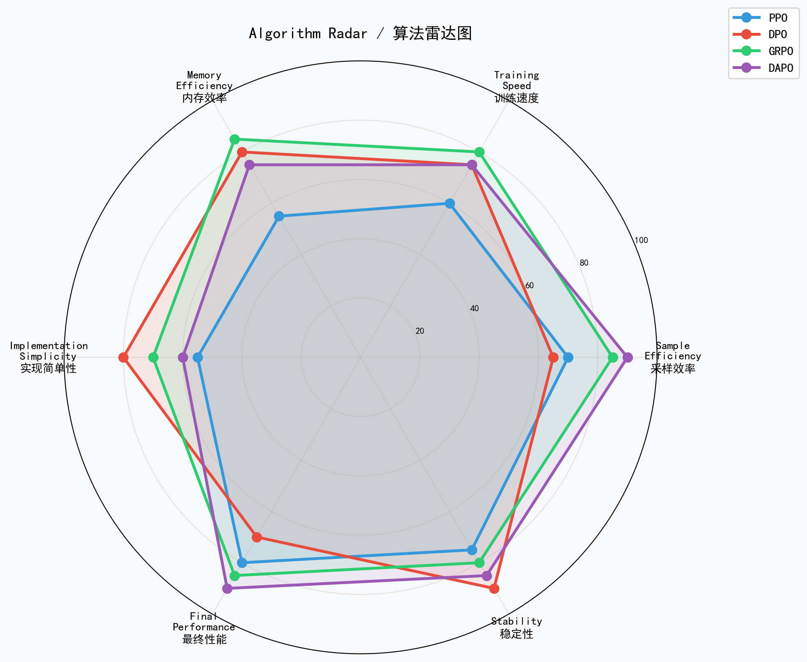
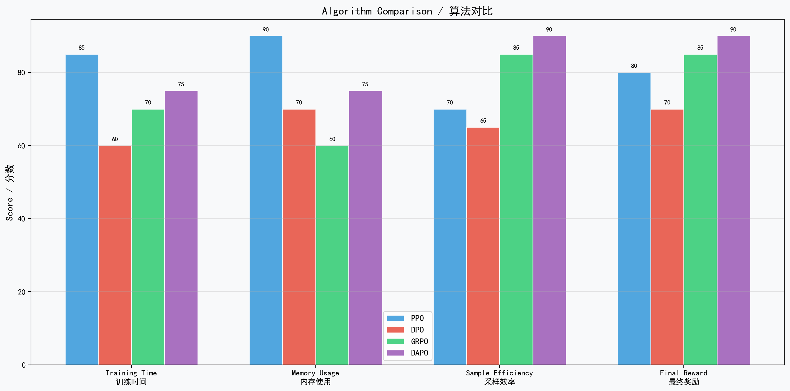
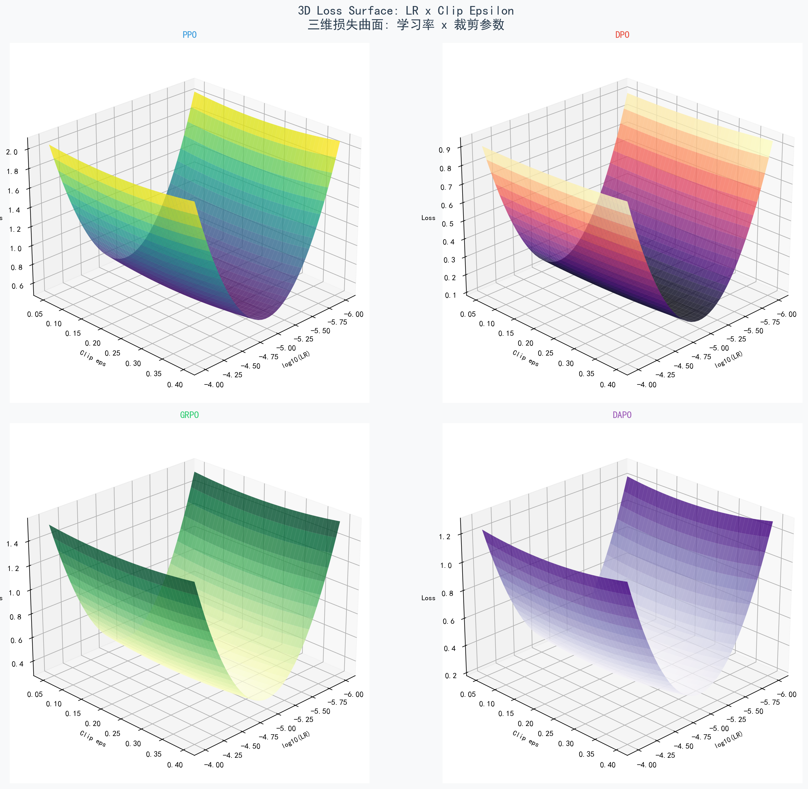
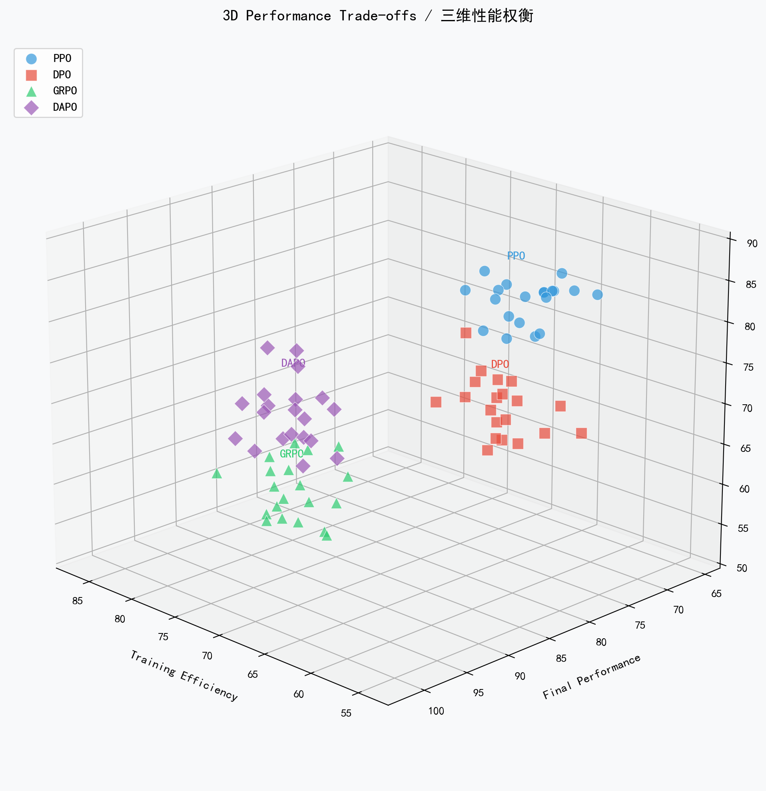

# DeepSeek R1 Qwen2-1.5B: RL Algorithm Implementations & Comparison

> PPO / DPO / GRPO / DAPO 四种强化学习算法的完整实现、流程分析与深度对比

[](LICENSE)
[]()

**Author:** Aitachi
**Contact:** 44158892@qq.com
**License:** MIT

---

## Overview

本项目基于 Qwen2-1.5B 模型，实现了四种主流的大语言模型强化学习算法，并进行了全面的对比分析：

| Algorithm | Full Name | Source | Core Innovation |
|:---|:---|:---|:---|
| **PPO** | Proximal Policy Optimization | Schulman et al., 2017 | Clipped surrogate + GAE |
| **DPO** | Direct Preference Optimization | Rafailov et al., 2023 | Preference pairs, no reward model |
| **GRPO** | Group Relative Policy Optimization | DeepSeek-AI, 2025 | Group advantage, no value network |
| **DAPO** | Dynamic Advantage Policy Optimization | ByteDance, 2025 | Dynamic sampling + token-level loss |

---

## Project Structure

```
├── algorithms/                    # Core implementations
│   ├── ppo_trainer.py            # PPO trainer
│   ├── dpo_trainer.py            # DPO trainer
│   ├── grpo_trainer.py           # GRPO trainer
│   └── dapo_trainer.py           # DAPO trainer
├── docs/                          # Documentation & visualizations
│   ├── PPO_Algorithm.md          # PPO deep dive
│   ├── DPO_Algorithm.md          # DPO deep dive
│   ├── GRPO_Algorithm.md         # GRPO deep dive
│   ├── DAPO_Algorithm.md         # DAPO deep dive
│   ├── Algorithm_Comparison.md   # Full comparison
│   ├── generate_all_figures.py   # Figure generation script
│   └── figures/                  # All visualization images
├── src/                           # Source code
│   ├── models/                   # Model definitions
│   ├── training/                 # Training scripts (4-stage)
│   ├── utils/                    # Utilities
│   └── fig/                      # Analysis figures
├── data/                          # Training data
├── scripts/                       # Helper scripts
├── run_comparison.py              # Algorithm comparison runner
└── requirements.txt               # Dependencies
```

---

## Quick Start

```bash
# Install dependencies
pip install -r requirements.txt

# Run full comparison
python run_comparison.py

# Generate all visualization figures
cd docs && python generate_all_figures.py
```

---

## Algorithm Details

### PPO (Proximal Policy Optimization)

PPO clips the probability ratio to prevent destructively large policy updates:

$$L_{PPO}(\theta) = \mathbb{E}_t\left[\min\left(r_t(\theta)\hat{A}_t,\ \text{clip}(r_t(\theta), 1-\varepsilon, 1+\varepsilon)\hat{A}_t\right)\right] - c_1 L^{VF} + c_2 S[\pi_\theta]$$

- Requires separate value network (Critic)
- Uses GAE for advantage estimation
- Entropy bonus for exploration


See [PPO Algorithm Documentation](docs/PPO_Algorithm.md)

---

### DPO (Direct Preference Optimization)

DPO simplifies RLHF by directly optimizing on preference pairs without a reward model:

$$L_{DPO}(\theta) = -\mathbb{E}_{(x,y_w,y_l)}\left[\log\sigma\left(\beta\log\frac{\pi_\theta(y_w|x)}{\pi_{ref}(y_w|x)} - \beta\log\frac{\pi_\theta(y_l|x)}{\pi_{ref}(y_l|x)}\right)\right]$$

- No value network, no reward model
- Based on Bradley-Terry preference model
- Most stable and simplest to implement


See [DPO Algorithm Documentation](docs/DPO_Algorithm.md)

---

### GRPO (Group Relative Policy Optimization)

GRPO eliminates the value network by using group statistics for advantage estimation:

$$J_{GRPO}(\theta) = \mathbb{E}\left[\frac{1}{G}\sum_{i=1}^{G}\min\left(\rho_i\hat{A}_i,\ \text{clip}(\rho_i)\hat{A}_i\right) - \beta D_{KL}\right]$$

$$\hat{A}_i = \frac{r_i - \text{mean}(r_{1:G})}{\text{std}(r_{1:G})}$$

- No value network needed
- Group sampling (G responses per question)
- Explicit KL divergence penalty


See [GRPO Algorithm Documentation](docs/GRPO_Algorithm.md)

---

### DAPO (Dynamic Advantage Policy Optimization)

DAPO extends GRPO with three key innovations:

$$L_{DAPO}(\theta) = -\mathbb{E}\left[\frac{1}{\sum|o_i|}\sum_{i=1}^{G}\frac{1}{|o_i|}\sum_{t=1}^{|o_i|}\min\left(r_t\hat{A}_i,\ \text{clip}(r_t)\hat{A}_i\right) - \beta D_{KL}^{token}\right]$$

Three innovations:
1. **Dynamic Sampling**: Group size G adapts based on reward variance
2. **Overlong Filtering**: Filters responses exceeding max length
3. **Token-Level Loss**: Normalizes by sequence length to prevent length bias


See [DAPO Algorithm Documentation](docs/DAPO_Algorithm.md)

---

## Algorithm Comparison

### Comprehensive Table

| Dimension | PPO | DPO | GRPO | DAPO |
|:---|:---|:---|:---|:---|
| Value Network | Required | Not needed | Not needed | Not needed |
| Reference Model | No | Yes | Yes | Yes |
| Sampling | 1 per query | Preference pair | Group (G) | Dynamic group |
| Loss Granularity | Sequence | Sequence | Sequence | Token-level |
| GPU Memory | Highest | Medium | Medium | Medium |
| Implementation | Complex | Simple | Moderate | Complex |
| Final Performance | High | Medium | High | Highest |

### Visualizations

**Loss Curves Comparison**


**Reward Curves Comparison**


**Multi-dimensional Radar**


**Metric Bar Chart**


**3D Loss Surface (Learning Rate x Clip Epsilon)**


**3D Performance Trade-offs**


See [Full Comparison Analysis](docs/Algorithm_Comparison.md)

---

## Training Configuration

| Parameter | PPO | DPO | GRPO | DAPO |
|:---|:---|:---|:---|:---|
| Learning Rate | 1e-5 | 5e-6 | 1e-5 | 1e-5 |
| Clip Epsilon | 0.2 | - | 0.2 | 0.2 |
| KL Coefficient | - | 0.1 | 0.01 | 0.01 |
| Group Size | - | - | 16 | 16 (dynamic) |
| Max Length | 512 | 512 | 512 | 1024 |

---

## References

1. Schulman, J., et al. "Proximal Policy Optimization Algorithms." arXiv:1707.06347, 2017.
2. Rafailov, R., et al. "Direct Preference Optimization: Your Language Model is Secretly a Reward Model." NeurIPS 2023.
3. DeepSeek-AI. "DeepSeek-R1: Incentivizing Reasoning Capability in LLMs via Reinforcement Learning." arXiv:2501.12948, 2025.
4. Yu, Q., et al. "DAPO: An Open-Source LLM Reinforcement Learning System." arXiv:2503.14476, 2025.

```bibtex
@software{aitachi2025rl_comparison,
  author = {Aitachi},
  title = {PPO, DPO, GRPO, and DAPO: Complete Implementation and Comparison},
  year = {2025},
  email = {44158892@qq.com}
}
```

---

## License

MIT License - see [LICENSE](LICENSE) file for details.

---

## Acknowledgments

- DeepSeek-AI team for GRPO algorithm and DeepSeek-R1 paper
- ByteDance for DAPO algorithm
- OpenAI for PPO algorithm
- Stanford NLP group for DPO algorithm
- Hugging Face for Transformers library
- Qwen team for base models
