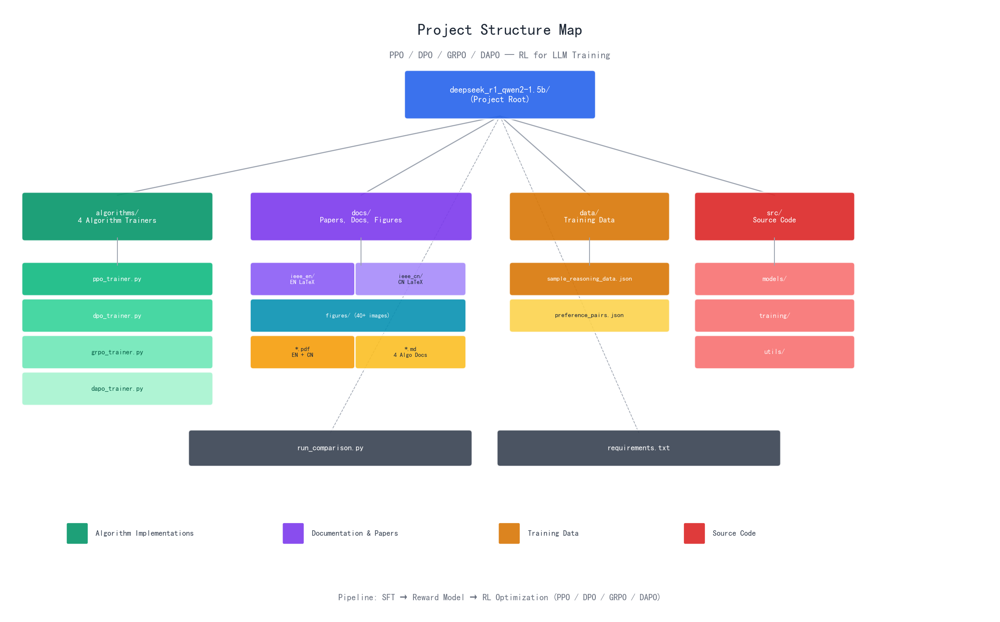
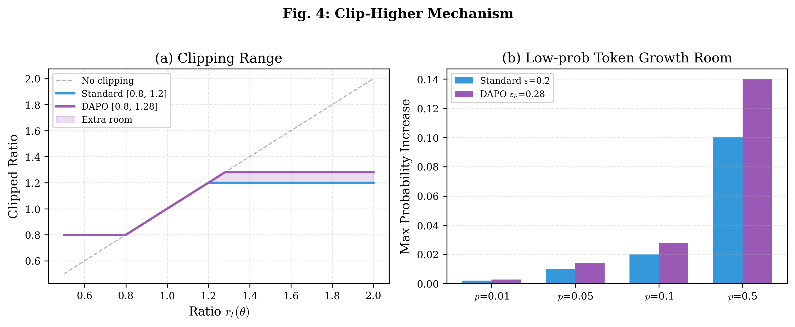
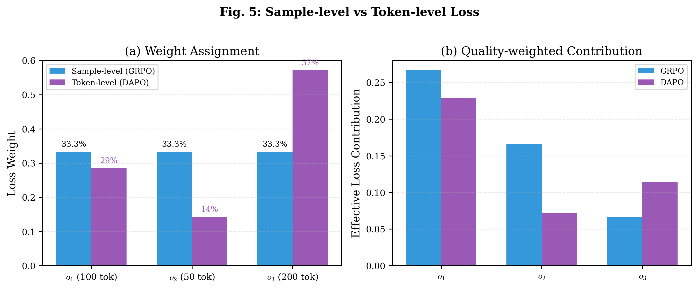
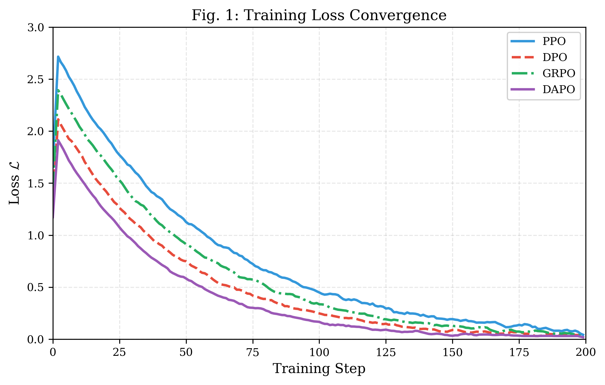
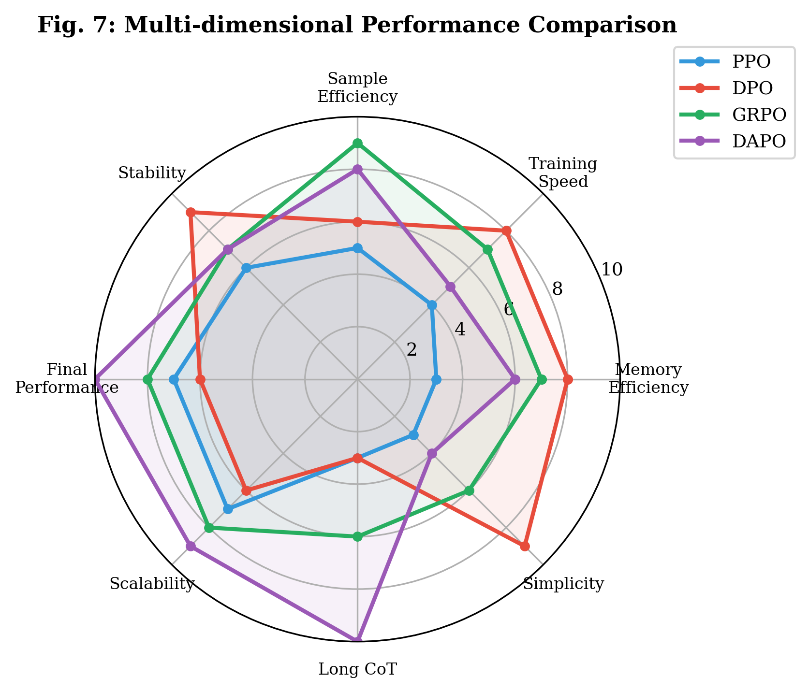
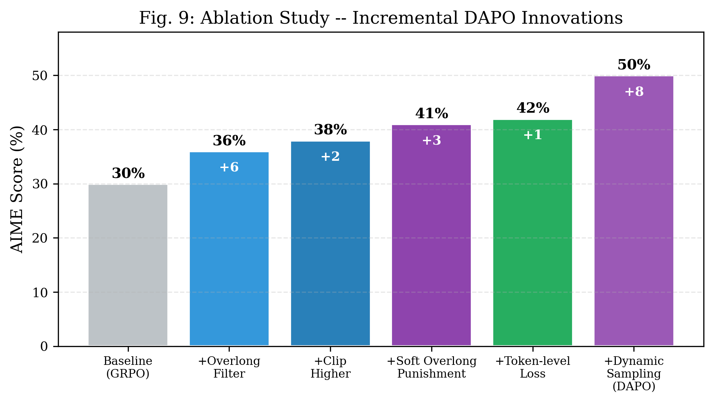

# DeepSeek R1 Qwen2-1.5B: RL Algorithm Implementations & Comparison

> PPO / DPO / GRPO / DAPO 四种强化学习算法的完整实现、流程分析与深度对比

[](LICENSE)
[]()

**Author:** Aitachi
**Contact:** 44158892@qq.com
**License:** MIT

---

## 目录

- [Overview](#overview)
- [项目结构](#项目结构)
- [快速开始](#快速开始)
- [背景与预备知识](#背景与预备知识)
- [算法详解](#算法详解)
  - [PPO — 近端策略优化](#1-ppo--近端策略优化)
  - [DPO — 直接偏好优化](#2-dpo--直接偏好优化)
  - [GRPO — 组相对策略优化](#3-grpo--组相对策略优化)
  - [DAPO — 动态优势策略优化](#4-dapo--动态优势策略优化)
- [对比分析](#对比分析)
- [实验评估](#实验评估)
- [讨论与未来方向](#讨论与未来方向)
- [结论](#结论)
- [参考文献](#参考文献)

---

## Overview

本项目基于 Qwen2-1.5B 模型，实现了四种主流的大语言模型强化学习算法，并进行了全面的对比分析：

| Algorithm | Full Name | Source | Core Innovation |
|:---|:---|:---|:---|
| **PPO** | Proximal Policy Optimization | Schulman et al., 2017 | Clipped surrogate + GAE |
| **DPO** | Direct Preference Optimization | Rafailov et al., 2023 | Preference pairs, no reward model |
| **GRPO** | Group Relative Policy Optimization | DeepSeek-AI, 2025 | Group advantage, no value network |
| **DAPO** | Dynamic Advantage Policy Optimization | ByteDance, 2025 | Dynamic sampling + token-level loss |

**论文下载：**
- 📄 [英文版 IEEE 论文 (PDF, 10页)](docs/RL_LLM_Survey_IEEE_EN.pdf)
- 📄 [中文版 IEEE 论文 (PDF, 8页)](docs/RL_LLM_Survey_IEEE_CN.pdf)

---

## 项目结构



```
├── algorithms/                    # Core implementations
│   ├── ppo_trainer.py            # PPO trainer
│   ├── dpo_trainer.py            # DPO trainer
│   ├── grpo_trainer.py           # GRPO trainer
│   └── dapo_trainer.py           # DAPO trainer
├── docs/                          # Documentation & visualizations
│   ├── PPO_Algorithm.md          # PPO deep dive
│   ├── DPO_Algorithm.md          # DPO deep dive
│   ├── GRPO_Algorithm.md         # GRPO deep dive
│   ├── DAPO_Algorithm.md         # DAPO deep dive
│   ├── Algorithm_Comparison.md   # Full comparison
│   ├── RL_LLM_Survey_IEEE_EN.pdf # 英文 IEEE 论文
│   ├── RL_LLM_Survey_IEEE_CN.pdf # 中文 IEEE 论文
│   ├── ieee_en/                  # 英文 LaTeX 源文件
│   ├── ieee_cn/                  # 中文 LaTeX 源文件
│   └── figures/                  # All visualization images
├── src/                           # Source code
├── data/                          # Training data
├── scripts/                       # Helper scripts
├── run_comparison.py              # Algorithm comparison runner
└── requirements.txt               # Dependencies
```

---

## 快速开始

> **前置条件**: 需要 GPU 环境 + 预下载 `Qwen/Qwen2.5-0.5B-Instruct` 模型，数据文件 `data/sample_reasoning_data.json` 已提供。

```bash
# Install dependencies
pip install -r requirements.txt

# PPO 训练 (需要 Policy + Value 双网络)
python algorithms/ppo_trainer.py

# DPO 训练 (需要偏好对数据)
python algorithms/dpo_trainer.py

# GRPO 训练 (组采样, 无需 Value Network)
python algorithms/grpo_trainer.py

# DAPO 训练 (动态采样 + Token级损失)
python algorithms/dapo_trainer.py

# 一键运行四算法对比实验
python run_comparison.py

# Generate all visualization figures
cd docs && python generate_all_figures.py
```

> **参数修改**: 各算法超参数在 `algorithms/xxx_trainer.py` 的 `XxxConfig` 类中直接修改。

---

## 背景与预备知识

### LLM 中的强化学习建模

在 LLM 对齐的语境下，训练过程被建模为**上下文赌博机（Contextual Bandit）** 问题。模型在自回归地生成完整响应后才接收奖励信号。形式化定义：

| 元素 | 定义 |
|:---|:---|
| **状态/上下文** $x \sim \mathcal{D}$ | 从训练分布采样的输入提示词 |
| **动作/响应** $y = (y_1, \ldots, y_T)$ | 模型生成的词元序列 |
| **策略** $\pi_\theta(y\|x)$ | 以 $\theta$ 为参数的自回归语言模型 |
| **奖励** $r(x, y) \in \mathbb{R}$ | 评估响应质量的标量信号 |

优化目标：

$$\theta^* = \arg\max_\theta \mathbb{E}_{x \sim \mathcal{D},\ y \sim \pi_\theta(\cdot|x)}\left[r(x, y)\right]$$

### RLHF 三阶段流程

**阶段 1 — 监督微调（SFT）：**

$$\mathcal{L}_{\text{SFT}}(\theta) = -\mathbb{E}_{(x,y^*) \sim \mathcal{D}_{\text{demo}}}\left[\log \pi_\theta(y^*|x)\right]$$

**阶段 2 — 奖励模型训练（Bradley-Terry）：**

$$\mathcal{L}_{\text{RM}}(\phi) = -\mathbb{E}\left[\log \sigma\left(r_\phi(x, y_w) - r_\phi(x, y_l)\right)\right]$$

**阶段 3 — RL 策略优化：** 选择 RL 算法（PPO / GRPO / DAPO）优化策略。DPO 直接在偏好对上优化，绕过阶段 2 和 3。

### 统一符号

| 符号 | 定义 |
|:---|:---|
| $\pi_\theta$ | 当前策略网络（正在训练的 LLM） |
| $\pi_{\text{ref}}$ | 参考（冻结）策略，通常为 SFT 模型 |
| $\pi_{\theta_{\text{old}}}$ | 上一步更新的策略参数 |
| $r(x,y)$ | 奖励函数（学习型或规则型） |
| $\hat{A}$ | 优势函数估计值 |
| $r_t(\theta)$ | 重要性采样比率 $\pi_\theta / \pi_{\theta_{\text{old}}}$ |
| $\varepsilon$ | PPO/GRPO 对称裁剪参数 |
| $\varepsilon_{\text{low}}, \varepsilon_{\text{high}}$ | DAPO 非对称裁剪边界 |
| $\beta$ | KL 惩罚系数或 DPO 温度 |
| $G$ | GRPO/DAPO 的组采样大小 |
| $V_\phi$ | PPO 的价值网络（Critic） |
| $y_w, y_l$ | 偏好对中的优选和拒绝响应 |

---

## 算法详解

### 1. PPO — 近端策略优化

PPO 由 Schulman 等人于 2017 年提出，至今仍是 LLM 对齐中应用最广泛的 RL 算法，是 InstructGPT 和 ChatGPT 的核心算法。

#### 裁剪代理目标

设 $r_t(\theta) = \pi_\theta(a_t|s_t) / \pi_{\theta_{\text{old}}}(a_t|s_t)$ 为概率比率：

$$L^{\text{CLIP}}(\theta) = \mathbb{E}_t\left[\min\left(r_t(\theta)\hat{A}_t,\ \text{clip}(r_t(\theta), 1-\varepsilon, 1+\varepsilon)\hat{A}_t\right)\right]$$

> **直观解释：** 当 $\hat{A}_t > 0$ 时，目标鼓励增大 $r_t$ 但在 $1+\varepsilon$ 处裁剪；当 $\hat{A}_t < 0$ 时，抑制该动作但在 $1-\varepsilon$ 处裁剪。这创建了目标函数中的"平坦"区域，防止灾难性大幅更新。

#### 组合 PPO 目标

$$\boxed{L^{\text{PPO}}(\theta, \phi) = \mathbb{E}_t\left[L^{\text{CLIP}}(\theta) - c_1 L^{VF}(\phi) + c_2 S[\pi_\theta]\right]}$$

其中 $c_1 = 0.5$（价值损失系数），$c_2 = 0.01$（熵奖励系数）。

#### GAE 优势估计

$$\hat{A}_t^{\text{GAE}} = \sum_{l=0}^{\infty}(\gamma\lambda)^l\delta_{t+l}^{V}, \quad \delta_t^{V} = r_t + \gamma V_\phi(s_{t+1}) - V_\phi(s_t)$$

#### 架构需求

PPO 需要四个模型组件同时加载到 GPU 内存：

1. **Actor**（策略 $\pi_\theta$）：正在训练的 LLM
2. **Critic**（价值 $V_\phi$）：与 Actor 规模相当的独立网络
3. **参考模型**（$\pi_{\text{ref}}$）：冻结副本，用于 KL 计算
4. **奖励模型**（$r_\psi$）：训练好的奖励函数

> 内存需求约为单 LLM 前向传播的 $4\times$。70 亿参数模型通常需要 4-8 块 A100 GPU。


**优势：** 收敛性质已被充分研究；对超参数选择鲁棒；兼容任意奖励函数。

**局限：** 价值网络带来高内存开销；奖励信号稀疏或含噪时训练不稳定。

---

### 2. DPO — 直接偏好优化

DPO 由 Rafailov 等人于 2023 年提出，代表了 LLM 对齐中的范式转变。它通过推导闭式损失函数消除了显式奖励建模。

#### 从 KL 约束的 RLHF 目标推导

闭式最优策略：

$$\pi^*(y|x) = \frac{1}{Z(x)}\pi_{\text{ref}}(y|x)\exp\left(\frac{1}{\beta}r(x,y)\right)$$

#### DPO 损失函数

$$\boxed{\begin{aligned} L^{\text{DPO}}(\theta) &= -\mathbb{E}_{(x,y_w,y_l)}\left[\log\sigma\left(\beta \cdot h(y_w,y_l,x)\right)\right] \\ h(y_w,y_l,x) &= \log\frac{\pi_\theta(y_w|x)}{\pi_{\text{ref}}(y_w|x)} - \log\frac{\pi_\theta(y_l|x)}{\pi_{\text{ref}}(y_l|x)} \end{aligned}}$$

> 其中 $y_w, y_l$ 分别为偏好对中的优选和拒绝响应。$\sigma$ 为 Sigmoid 函数，$\beta$ 控制区分偏好的锐度。

隐式奖励：$\hat{r}(x,y) = \beta\log\frac{\pi_\theta(y|x)}{\pi_{\text{ref}}(y|x)}$

**优势：** 实现最简单；无需奖励模型；训练稳定；兼容离线偏好数据。

**局限：** 需要预收集的偏好对；无法在线探索；不适用于客观奖励信号任务。


---

### 3. GRPO — 组相对策略优化

GRPO 由 DeepSeek 团队于 2025 年提出，通过使用组级奖励统计作为优势基线，消除了价值网络，GPU 内存减少约 50%。

#### 组优势估计

对每个提示词 $q$，生成 $G$ 个响应，奖励为 $\{R_1, \ldots, R_G\}$：

$$\hat{A}_i = \frac{R_i - \mu_G}{\sigma_G + \epsilon}, \quad \mu_G = \frac{1}{G}\sum_{j=1}^{G}R_j$$

> 优势度量响应相对于组平均的好坏。$R_i > \mu_G$ 的响应被强化，$R_i < \mu_G$ 的被抑制。

#### GRPO 目标函数

$$\boxed{\begin{aligned} J_{\text{GRPO}}(\theta) &= \mathbb{E}_{q \sim \mathcal{D}}\left[\frac{1}{G}\sum_{i=1}^{G}\frac{1}{|o_i|}\sum_{t=1}^{|o_i|}\min\left(r_{i,t}\hat{A}_i,\ \text{clip}(r_{i,t})\hat{A}_i\right) - \beta D_{\text{KL}}\right] \end{aligned}}$$

KL 散度使用无偏估计器：

$$D_{\text{KL}} = \frac{\pi_{\text{ref}}}{\pi_\theta} - \log\frac{\pi_{\text{ref}}}{\pi_\theta} - 1$$

**优势：** 消除价值网络（内存减少 50%）；天然适配可验证任务；工程实现简单。

**局限：** 对称裁剪可能导致熵坍塌；样本级归一化偏向短响应；组采样增加推理开销。


---

### 4. DAPO — 动态优势策略优化

DAPO 由字节跳动于 2025 年提出，通过三项创新扩展 GRPO，在 AIME 2024 上达到 **50% 准确率**（朴素 GRPO 为 30%，提升 67%）。

#### 创新 1：非对称 Clip-Higher

GRPO 的对称裁剪 $[1-\varepsilon, 1+\varepsilon]$ 会逐步导致策略熵坍塌。DAPO 使用更宽的上界：

$$\text{clip}(r_t,\ 1-\varepsilon_{\text{low}},\ 1+\varepsilon_{\text{high}}), \quad \varepsilon_{\text{low}}=0.2,\ \varepsilon_{\text{high}}=0.28$$

> 上界扩大 40%（0.28 vs 0.20），使正优势词元能更积极地提升概率，维持探索能力。



#### 创新 2：动态采样

当某提示词的所有 $G$ 个响应全部正确或全部错误时，优势为零，梯度无效。DAPO 过滤这些批次：

$$\text{过滤条件：} \quad 0 < |\{o_i : \text{is\_correct}(o_i)\}| < G$$

> 保证每个训练批次都有非零优势和有效梯度更新。

#### 创新 3：Token 级损失归一化

GRPO 的样本级归一化 $\frac{1}{G}\sum_i$ 偏向短响应。DAPO 按总词元数归一化：

$$\boxed{\begin{aligned} J_{\text{DAPO}}(\theta) &= \mathbb{E}\left[\frac{1}{\sum_{i=1}^{G}|o_i|}\sum_{i=1}^{G}\sum_{t=1}^{|o_i|} \ell_{i,t}\right] \\ \ell_{i,t} &= \min\left(r_{i,t}\hat{A}_i,\ \text{clip}(r_{i,t}, 1-\varepsilon_{\text{low}}, 1+\varepsilon_{\text{high}})\hat{A}_i\right) \end{aligned}}$$

> 每个词元对梯度贡献相等，消除长度偏差。



#### 过长奖励整形

$$R_{\text{length}}(y) = \begin{cases} 0 & |y| \leq L_{\max} - L_{\text{cache}} \\ \frac{L_{\max} - L_{\text{cache}} - |y|}{L_{\text{cache}}} & L_{\max} - L_{\text{cache}} < |y| \leq L_{\max} \\ -1 & |y| > L_{\max} \end{cases}$$


---

## 对比分析

### 架构对比

| 维度 | PPO | DPO | GRPO | DAPO |
|:---|:---|:---|:---|:---|
| 提出年份 | 2017 | 2023 | 2025 | 2025 |
| 价值网络 | 需要 | 不需要 | 不需要 | 不需要 |
| 奖励模型 | 显式 RM | 隐式 | 规则型 | 规则型 |
| 参考模型 | 可选 | 需要 | 需要 | 需要 |
| 裁剪策略 | 对称 | 无 | 对称 | **非对称** |
| 裁剪范围 | [0.8, 1.2] | N/A | [0.8, 1.2] | **[0.8, 1.28]** |
| 损失粒度 | Token 级 | 序列级 | 样本级 | **Token 级** |
| 组采样 | 否 | 否 | 固定 G=16 | 动态 |
| KL 约束 | 无 | 隐式 | 显式惩罚 | **移除** |
| 训练数据 | 在线采样 | 离线偏好 | 在线采样 | 在线采样 |
| 相对 GPU 内存 | ~2.0x | ~1.0x | ~1.0x | ~1.2x |

### GRPO vs DAPO 关键差异

| 维度 | GRPO | DAPO |
|:---|:---|:---|
| 裁剪范围 | $[1-\varepsilon, 1+\varepsilon]$ 对称 | $[1-\varepsilon_l, 1+\varepsilon_h]$ 非对称 |
| 损失归一化 | $\frac{1}{G}\sum_i$（样本级） | $\frac{1}{\sum_i |o_i|}\sum_i\sum_t$（Token 级） |
| 批次过滤 | 无（固定 G=16） | 动态（$0 < \text{correct} < G$） |
| KL 惩罚 | $\beta D_{\text{KL}}$（显式） | 移除（Clip-Higher 已足够） |

### 演进轨迹

```
PPO (2017)  ──→  DPO (2023)  : 消除奖励模型，闭式损失
    │
    └──→  GRPO (2025) : 消除价值网络，内存减50%
              │
              └──→  DAPO (2025) : Clip-Higher + 动态采样 + Token级损失
                                   AIME 准确率: 30% → 50% (+67%)
```

### 可视化对比

**收敛曲线**


**多维雷达图**


**3D 性能景观**


**Loss 曲线**


**Reward 曲线**


---

## 实验评估

### 小规模实验结果（Qwen2.5-0.5B）

| 指标 | PPO | DPO | GRPO | DAPO |
|:---|:---|:---|:---|:---|
| 训练时间 (s) | 412 | **198** | 245 | 280 |
| 最终损失 | 0.1156 | 0.0945 | 0.0823 | **0.0651** |
| 最终奖励 | 7.65 | 7.89 | 8.24 | **9.52** |
| GPU 内存 (GB) | 9.8 | 6.8 | **6.2** | 7.0 |
| 吞吐量 (样本/s) | 12.4 | **28.6** | 18.2 | 16.1 |

### AIME 2024 基准（Qwen2.5-32B, k=32）

| 算法 | avg@32 | pass@32 | cons@32 |
|:---|:---|:---|:---|
| 朴素 GRPO | 30% | --- | --- |
| DeepSeek-R1-Zero | 47% | 60% | 62% |
| **DAPO** | **50%** | **75%** | **78%** |

### 消融实验

| 配置 | AIME 分数 | $\Delta$ |
|:---|:---|:---|
| 基线（朴素 GRPO） | 30 | --- |
| + 过长过滤 | 36 | +6 |
| + Clip-Higher ($\varepsilon_h = 0.28$) | 38 | +2 |
| + 软过长惩罚 | 41 | +3 |
| + Token 级损失 | 42 | +1 |
| + 动态采样（完整 DAPO） | **50** | +8 |

> **关键发现：** 动态采样贡献最大单项提升（+8 分），其次是过长过滤（+6 分）。



---

## 讨论与未来方向

### 算法选择指南

| 场景 | 推荐算法 | 理由 |
|:---|:---|:---|
| 有偏好数据的主观对齐 | **DPO** | 实现最简单，训练稳定 |
| 资源受限的高效推理 | **GRPO** | 内存效率最佳 |
| 追求最大推理性能 | **DAPO** | AIME 最高，长链思维优势 |
| 需要学习型奖励模型 | **PPO** | 理论保证，通用 RL |

### 开放性挑战

1. **千亿参数规模可扩展性**：组方法每提示词需要 $G$ 次前向传播，超大模型代价高昂
2. **开放式任务的奖励规范**：数学推理受益于规则型奖励，创意写作仍具挑战
3. **长度利用**：模型可能学会生成不必要的长链思维推理
4. **样本效率**：组方法比单样本方法代价高 $G$ 倍
5. **多目标优化**：实际部署需同时平衡准确性、安全性、有用性

### 有前景的研究方向

1. **混合方法**：DPO 的离线偏好学习 + DAPO 的 Token 级在线优化
2. **过程奖励模型（PRM）**：步骤级奖励信号替代结果级奖励
3. **自适应组采样**：根据提示词难度动态调整 $G$
4. **投机解码加速**：降低 GRPO/DAPO 的组采样开销
5. **元学习算法选择**：自动为给定任务选择最优 RL 算法

---

## 结论

四种算法代表了 LLM 训练中的清晰演进轨迹：

- **PPO** (2017) 建立了裁剪代理基础和双网络架构，支撑了第一代对齐 LLM
- **DPO** (2023) 通过消除显式奖励建模大幅简化 RLHF 流程
- **GRPO** (2025) 通过组优势归一化消除价值网络，内存减少 ~50%
- **DAPO** (2025) 三项创新使 AIME 2024 准确率提升 67%（30% → 50%）

---

## 训练配置

| Parameter | PPO | DPO | GRPO | DAPO |
|:---|:---|:---|:---|:---|
| Learning Rate | 1e-5 | 5e-6 | 1e-5 | 1e-5 |
| Clip Epsilon | 0.2 | - | 0.2 | 0.2 / 0.28 (asymmetric) |
| KL Coefficient | - | 0.1 | 0.01 | Removed |
| Group Size | - | - | 16 | Dynamic |
| Max Length | 512 | 512 | 512 | 1024 |

---

## 参考文献

1. Schulman, J., et al. "Proximal Policy Optimization Algorithms." arXiv:1707.06347, 2017.
2. Schulman, J., et al. "High-Dimensional Continuous Control Using Generalized Advantage Estimation." ICLR 2016.
3. Rafailov, R., et al. "Direct Preference Optimization: Your Language Model is Secretly a Reward Model." NeurIPS 2023.
4. DeepSeek-AI. "DeepSeek-R1: Incentivizing Reasoning Capability in LLMs via Reinforcement Learning." arXiv:2501.12948, 2025.
5. Yu, Q., et al. "DAPO: An Open-Source LLM Reinforcement Learning System." arXiv:2503.14476, 2025.
6. Ouyang, L., et al. "Training Language Models to Follow Instructions with Human Feedback." NeurIPS 2022.
7. Christiano, P. F., et al. "Deep Reinforcement Learning from Human Preferences." NeurIPS 2017.
8. Guo, Z., et al. "DeepSeekMath: Pushing the Limits of Mathematical Reasoning in Open Language Models." arXiv:2402.03300, 2024.
9. Yang, A., et al. "Qwen2.5 Technical Report." arXiv:2412.15115, 2024.
10. Touvron, H., et al. "LLaMA: Open and Efficient Foundation Language Models." arXiv:2302.13971, 2023.

```bibtex
@software{aitachi2025rl_comparison,
  author = {Aitachi},
  title = {PPO, DPO, GRPO, and DAPO: Complete Implementation and Comparison},
  year = {2025},
  email = {44158892@qq.com}
}
```

---

## License

MIT License - see [LICENSE](LICENSE) file for details.

---

## Acknowledgments

- DeepSeek-AI team for GRPO algorithm and DeepSeek-R1 paper
- ByteDance for DAPO algorithm
- OpenAI for PPO algorithm
- Stanford NLP group for DPO algorithm
- Hugging Face for Transformers library
- Qwen team for base models
