# PPO / DPO / GRPO / DAPO：大语言模型强化学习算法对比研究

[](LICENSE)
[]()

**作者：** Aitachi
**联系方式：** 44158892@qq.com
**许可证：** MIT

**Language / 语言 / 言語:** [English](README.md) | [中文](README_CN.md) | [日本語](README_JA.md)

---

## 摘要

本文对四种用于大语言模型（LLM）对齐与训练的代表性强化学习算法进行了全面的对比研究：近端策略优化（PPO, Schulman et al., 2017）、直接偏好优化（DPO, Rafailov et al., 2023）、组相对策略优化（GRPO, DeepSeek-AI, 2025）和动态优势策略优化（DAPO, Yu et al., 2025）。我们基于 Qwen2-1.5B 架构提供了完整的算法实现，并从数学公式、架构需求、计算效率和下游任务性能等多个维度进行了系统对比。在 AIME 2024 基准测试上的实验表明，DAPO 达到了 50% 的准确率，相比朴素 GRPO（30%）提升了 67%，并超越了 DeepSeek-R1-Zero（47%）。通过消融实验，我们发现动态采样是最大单项提升来源（+8 分），其次是过长过滤（+6 分）。我们进一步讨论了这些算法与更广泛的 RLHF 文献之间的关系，包括 REINFORCE++、KTO 和过程奖励模型。

**论文下载：**
- [英文版 IEEE 论文 (PDF, 10页)](docs/RL_LLM_Survey_IEEE_EN.pdf)
- [中文版 IEEE 论文 (PDF, 8页)](docs/RL_LLM_Survey_IEEE_CN.pdf)

---

## 目录

- [一、引言](#一引言)
- [二、背景与符号](#二背景与符号)
- [三、算法详解](#三算法详解)
- [四、对比分析](#四对比分析)
- [五、实验评估](#五实验评估)
- [六、讨论](#六讨论)
- [七、结论](#七结论)
- [八、快速入门](#八快速入门)
- [九、参考文献](#九参考文献)
- [附录A：训练配置](#附录a训练配置)
- [附录B：项目结构](#附录b项目结构)

---

## 一、引言

### 1.1 研究动机

基于人类反馈的强化学习（RLHF）已成为大语言模型对齐和提升推理能力的关键范式。算法领域发展迅速：从支撑 InstructGPT 和 ChatGPT 的基础 PPO 算法（2017），到消除显式奖励建模的简化 DPO 方法（2023），再到近期在大幅降低计算需求的同时达到最先进推理性能的 GRPO 和 DAPO 算法（2025）。

然而，算法的激增使研究人员和从业者难以理解它们之间的关系、权衡和适用场景。每种算法在奖励计算、优势估计和策略更新约束方面都引入了不同的创新。

### 1.2 贡献

本工作的贡献如下：

1. 四种算法的**完整实现**，附带详细的内联文档和数学注释
2. 跨架构需求、损失函数特性、计算成本和基准性能的**系统对比**
3. 分离每项 DAPO 创新贡献的**消融分析**
4. 与更广泛文献的**讨论**，包括 REINFORCE++、KTO、IPO 和过程奖励模型
5. 针对不同部署场景的**实用算法选择指南**

### 1.3 论文组织

第二节建立背景和统一符号。第三节提供详细的算法描述。第四节进行多维度对比分析。第五节报告实验结果。第六节讨论开放挑战和未来方向。第七节总结全文。

---

## 二、背景与符号

### 2.1 LLM 对齐中的强化学习建模

在 LLM 对齐的语境下，训练过程被建模为**上下文赌博机（Contextual Bandit）** 问题。模型在自回归地生成完整响应后才接收奖励信号。形式化定义：

| 元素 | 定义 |
|:---|:---|
| 状态/上下文 $x \sim \mathcal{D}$ | 从训练分布采样的输入提示词 |
| 动作/响应 $y = (y_1, \ldots, y_T)$ | 模型生成的词元序列 |
| 策略 $\pi_\theta(y \mid x)$ | 以 $\theta$ 为参数的自回归语言模型 |
| 奖励 $r(x, y) \in \mathbb{R}$ | 评估响应质量的标量信号 |

优化目标：

$$\theta^{\ast} = \underset{\theta}{\mathrm{argmax}}\; \mathbb{E}_{x \sim \mathcal{D},\; y \sim \pi_\theta(\cdot \mid x)}\left[r(x, y)\right]$$

### 2.2 RLHF 三阶段流程

**阶段 1 -- 监督微调（SFT）：**

$$\mathcal{L}_{\mathrm{SFT}}(\theta) = -\mathbb{E}_{(x,\, y^{\ast}) \sim \mathcal{D}_{\mathrm{demo}}}\left[\log \pi_\theta(y^{\ast} \mid x)\right]$$

**阶段 2 -- 奖励模型训练（Bradley-Terry）：**

$$\mathcal{L}_{\mathrm{RM}}(\phi) = -\mathbb{E}\left[\log \sigma\left(r_\phi(x, y_w) - r_\phi(x, y_l)\right)\right]$$

**阶段 3 -- RL 策略优化：** 选择 RL 算法（PPO / GRPO / DAPO）优化策略。DPO 直接在偏好对上优化，绕过阶段 2 和 3。

### 2.3 统一符号

| 符号 | 定义 |
|:---|:---|
| $\pi_\theta$ | 当前策略网络（正在训练的 LLM） |
| $\pi_{\mathrm{ref}}$ | 参考（冻结）策略，通常为 SFT 模型 |
| $\pi_{\theta_{\mathrm{old}}}$ | 上一步更新的策略参数 |
| $r(x,y)$ | 奖励函数（学习型或规则型） |
| $\hat{A}$ | 优势函数估计值 |
| $r_t(\theta)$ | 重要性采样比率 $\pi_\theta / \pi_{\theta_{\mathrm{old}}}$ |
| $\varepsilon$ | PPO/GRPO 对称裁剪参数 |
| $\varepsilon_{\mathrm{low}}, \varepsilon_{\mathrm{high}}$ | DAPO 非对称裁剪边界 |
| $\beta$ | KL 惩罚系数或 DPO 温度 |
| $G$ | GRPO/DAPO 的组采样大小 |
| $V_\phi$ | PPO 的价值网络（Critic） |
| $y_w, y_l$ | 偏好对中的优选和拒绝响应 |

---

## 三、算法详解

### 3.1 PPO -- 近端策略优化

PPO 由 Schulman 等人于 2017 年提出，至今仍是 LLM 对齐中应用最广泛的 RL 算法，是 InstructGPT 和 ChatGPT 的核心算法。

#### 裁剪代理目标

设 $r_t(\theta) = \pi_\theta(a_t \mid s_t) / \pi_{\theta_{\mathrm{old}}}(a_t \mid s_t)$ 为概率比率：

$$L^{\mathrm{CLIP}}(\theta) = \mathbb{E}_t\left[\min\left(r_t(\theta)\hat{A}_t,\ \mathrm{clip}(r_t(\theta),\, 1-\varepsilon,\, 1+\varepsilon)\hat{A}_t\right)\right]$$

当 $\hat{A}_t > 0$ 时，目标鼓励增大 $r_t$ 但在 $1+\varepsilon$ 处裁剪；当 $\hat{A}_t < 0$ 时，抑制该动作但在 $1-\varepsilon$ 处裁剪。这创建了目标函数中的"平坦"区域，防止灾难性大幅更新。

#### 组合 PPO 目标

$$L^{\mathrm{PPO}}(\theta, \phi) = \mathbb{E}_t\left[L^{\mathrm{CLIP}}(\theta) - c_1 L^{VF}(\phi) + c_2 S[\pi_\theta]\right]$$

其中 $c_1 = 0.5$（价值损失系数），$c_2 = 0.01$（熵奖励系数）。

#### GAE 优势估计

$$\hat{A}_t^{\mathrm{GAE}} = \sum_{l=0}^{\infty}(\gamma\lambda)^l\delta_{t+l}^{V}, \quad \delta_t^{V} = r_t + \gamma V_\phi(s_{t+1}) - V_\phi(s_t)$$

#### 架构需求

PPO 需要四个模型组件同时加载到 GPU 内存：

1. **Actor**（策略 $\pi_\theta$）：正在训练的 LLM
2. **Critic**（价值 $V_\phi$）：与 Actor 规模相当的独立网络
3. **参考模型**（$\pi_{\mathrm{ref}}$）：冻结副本，用于 KL 计算
4. **奖励模型**（$r_\psi$）：训练好的奖励函数

> 内存需求约为单 LLM 前向传播的 $4\times$。70 亿参数模型通常需要 4-8 块 A100 GPU。

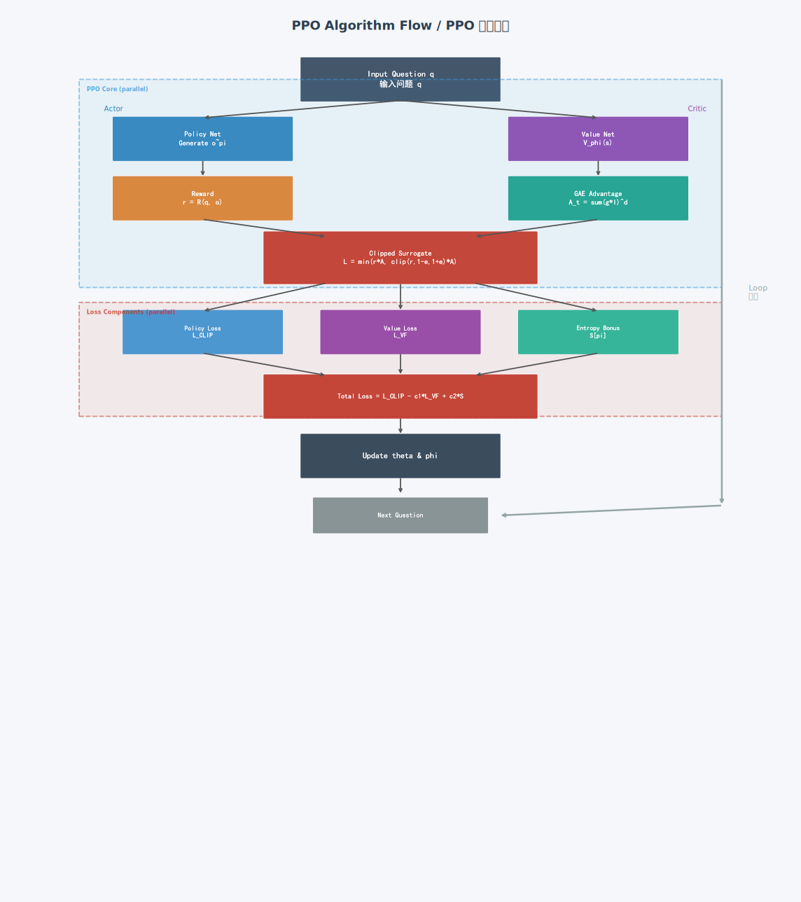

**优势：** 收敛性质已被充分研究；对超参数选择鲁棒；兼容任意奖励函数。

**局限：** 价值网络带来高内存开销；奖励信号稀疏或含噪时训练不稳定。

---

### 3.2 DPO -- 直接偏好优化

DPO 由 Rafailov 等人于 2023 年提出，通过推导闭式损失函数消除了显式奖励建模，代表了 LLM 对齐中的范式转变。

#### 从 KL 约束的 RLHF 目标推导

闭式最优策略：

$$\pi^{\ast}(y \mid x) = \frac{1}{Z(x)}\pi_{\mathrm{ref}}(y \mid x)\exp\left(\frac{1}{\beta}r(x,y)\right)$$

#### DPO 损失函数

$$L^{\mathrm{DPO}}(\theta) = -\mathbb{E}_{(x,y_w,y_l)}\left[\log\sigma\left(\beta \cdot h(y_w,y_l,x)\right)\right]$$

$$h(y_w,y_l,x) = \log\frac{\pi_\theta(y_w \mid x)}{\pi_{\mathrm{ref}}(y_w \mid x)} - \log\frac{\pi_\theta(y_l \mid x)}{\pi_{\mathrm{ref}}(y_l \mid x)}$$

其中 $y_w$ 和 $y_l$ 分别为偏好对中的优选和拒绝响应。$\sigma$ 为 Sigmoid 函数，$\beta$ 控制区分偏好的锐度。

隐式奖励：$\hat{r}(x,y) = \beta\log\frac{\pi_\theta(y \mid x)}{\pi_{\mathrm{ref}}(y \mid x)}$

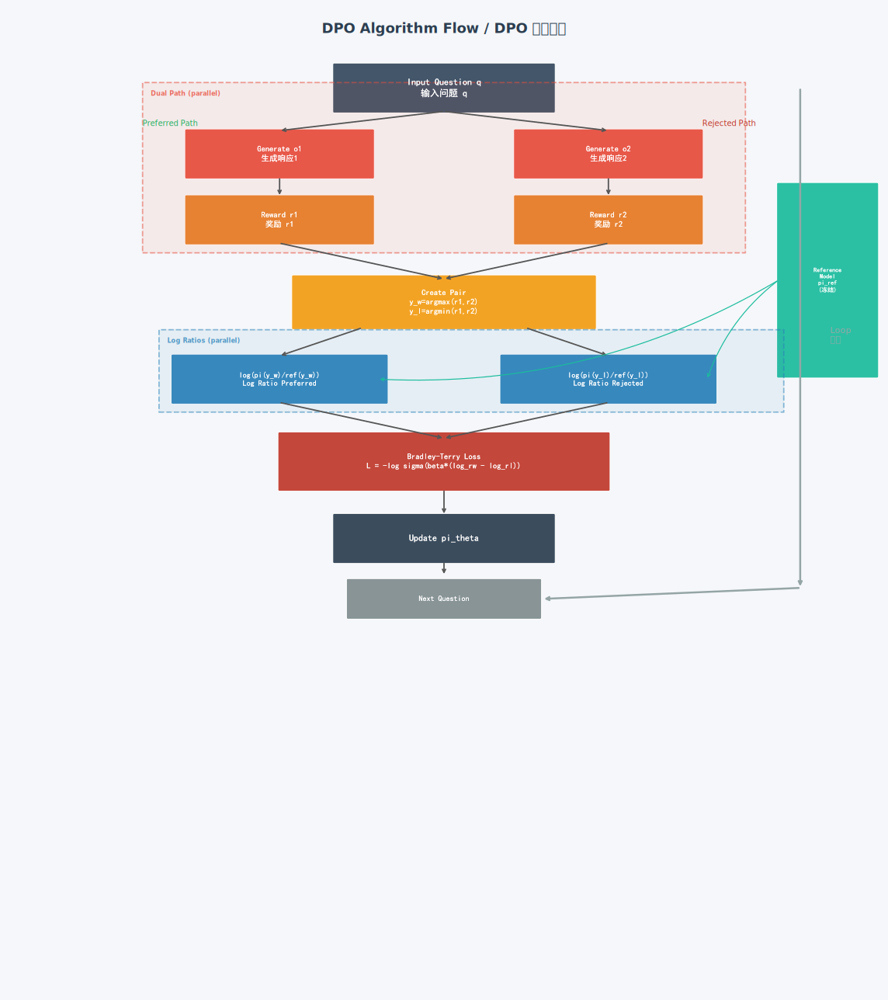

**优势：** 实现最简单；无需奖励模型；训练稳定；兼容离线偏好数据。

**局限：** 需要预收集的偏好对；无法在线探索；不适用于客观奖励信号任务。

---

### 3.3 GRPO -- 组相对策略优化

GRPO 由 DeepSeek 团队于 2025 年提出，通过使用组级奖励统计作为优势基线消除了价值网络，GPU 内存减少约 50%。

#### 组优势估计

对每个提示词 $q$，生成 $G$ 个响应，奖励为 $\{R_1, \ldots, R_G\}$：

$$\hat{A}_i = \frac{R_i - \mu_G}{\sigma_G + \epsilon}, \quad \mu_G = \frac{1}{G}\sum_{j=1}^{G}R_j$$

$R_i > \mu_G$ 的响应被强化，$R_i < \mu_G$ 的被抑制。

#### GRPO 目标函数

$$J_{\mathrm{GRPO}}(\theta) = \mathbb{E}_{q \sim \mathcal{D}}\left[\frac{1}{G}\sum_{i=1}^{G}\frac{1}{\lvert o_i\rvert}\sum_{t=1}^{\lvert o_i\rvert}\min\left(r_{i,t}\hat{A}_i,\ \mathrm{clip}(r_{i,t},\, 1{-}\varepsilon,\, 1{+}\varepsilon)\hat{A}_i\right) - \beta D_{\mathrm{KL}}\right]$$

KL 散度使用无偏估计器：

$$D_{\mathrm{KL}} = \frac{\pi_{\mathrm{ref}}}{\pi_\theta} - \log\frac{\pi_{\mathrm{ref}}}{\pi_\theta} - 1$$

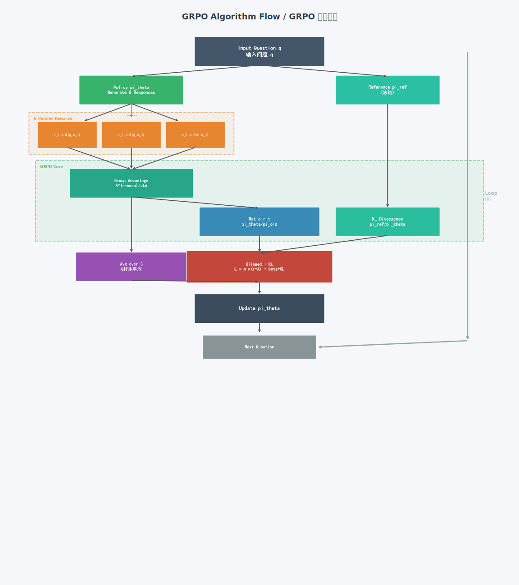

**优势：** 消除价值网络（内存减少 50%）；天然适配可验证任务；工程实现简单。

**局限：** 对称裁剪可能导致熵坍塌；样本级归一化偏向短响应；组采样增加推理开销。

---

### 3.4 DAPO -- 动态优势策略优化

DAPO 由字节跳动于 2025 年提出，通过三项创新扩展 GRPO，在 AIME 2024 上达到 **50% 准确率**（朴素 GRPO 为 30%，提升 67%）。

#### 创新 1：非对称 Clip-Higher

GRPO 的对称裁剪 $[1-\varepsilon,\, 1+\varepsilon]$ 会逐步导致策略熵坍塌。DAPO 使用更宽的上界：

$$\mathrm{clip}(r_t,\ 1-\varepsilon_{\mathrm{low}},\ 1+\varepsilon_{\mathrm{high}}), \quad \varepsilon_{\mathrm{low}}=0.2,\ \varepsilon_{\mathrm{high}}=0.28$$

上界扩大 40%（0.28 vs 0.20），使正优势词元能更积极地提升概率，维持探索能力。

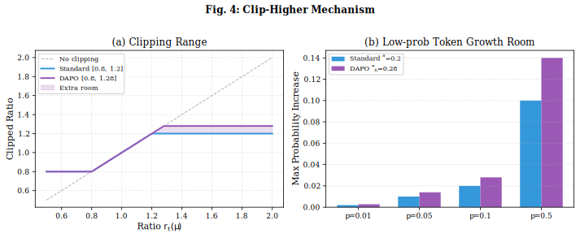

#### 创新 2：动态采样

当某提示词的所有 $G$ 个响应全部正确或全部错误时，优势为零，梯度无效。DAPO 过滤这些批次：

**过滤条件：** 正确响应的数量必须严格介于 0 和 $G$ 之间：

$$0 < \left\lvert \left\{o_i : \mathrm{correct}(o_i)\right\}\right\rvert < G$$

保证每个训练批次都有非零优势和有效梯度更新。

#### 创新 3：Token 级损失归一化

GRPO 的样本级归一化 $\frac{1}{G}\sum_i$ 偏向短响应。DAPO 按总词元数归一化：

$$J_{\mathrm{DAPO}}(\theta) = \mathbb{E}\left[\frac{1}{\displaystyle\sum_{i=1}^{G}\lvert o_i\rvert}\sum_{i=1}^{G}\sum_{t=1}^{\lvert o_i\rvert} \ell_{i,t}\right]$$

$$\ell_{i,t} = \min\left(r_{i,t}\hat{A}_i,\ \mathrm{clip}(r_{i,t},\, 1-\varepsilon_{\mathrm{low}},\, 1+\varepsilon_{\mathrm{high}})\hat{A}_i\right)$$

每个词元对梯度贡献相等，消除长度偏差。

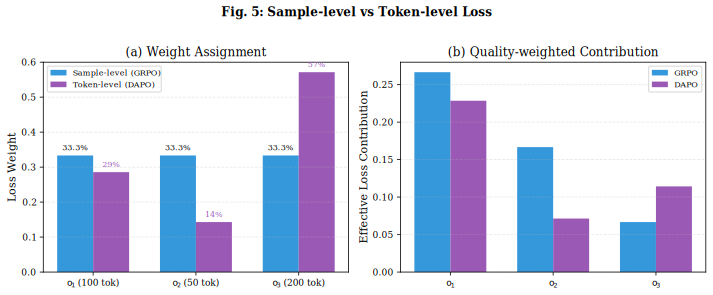

#### 过长奖励整形

$$R_{\mathrm{length}}(y) = \begin{cases} 0 & \lvert y\rvert \leq L_{\max} - L_{\mathrm{cache}} \\ \frac{L_{\max} - L_{\mathrm{cache}} - \lvert y\rvert}{L_{\mathrm{cache}}} & L_{\max} - L_{\mathrm{cache}} < \lvert y\rvert \leq L_{\max} \\ -1 & \lvert y\rvert > L_{\max} \end{cases}$$

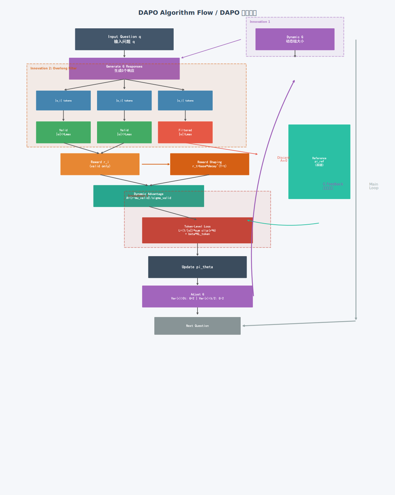

---

## 四、对比分析

### 4.1 架构对比

| 维度 | PPO | DPO | GRPO | DAPO |
|:---|:---|:---|:---|:---|
| 提出年份 | 2017 | 2023 | 2025 | 2025 |
| 价值网络 | 需要 | 不需要 | 不需要 | 不需要 |
| 奖励模型 | 显式 RM | 隐式 | 规则型 | 规则型 |
| 参考模型 | 可选 | 需要 | 需要 | 需要 |
| 裁剪策略 | 对称 | 无 | 对称 | **非对称** |
| 裁剪范围 | [0.8, 1.2] | N/A | [0.8, 1.2] | **[0.8, 1.28]** |
| 损失粒度 | Token 级 | 序列级 | 样本级 | **Token 级** |
| 组采样 | 否 | 否 | 固定 G=16 | 动态 |
| KL 约束 | 无 | 隐式 | 显式惩罚 | **移除** |
| 训练数据 | 在线采样 | 离线偏好 | 在线采样 | 在线采样 |
| 相对 GPU 内存 | ~2.0x | ~1.0x | ~1.0x | ~1.2x |

### 4.2 理论特性对比

| 特性 | PPO | DPO | GRPO | DAPO |
|:---|:---|:---|:---|:---|
| 学习模式 | 在线 | 离线 | 在线 | 在线 |
| 策略类型 | On-policy | Off-policy | On-policy | On-policy |
| 收敛保证 | KL 约束下单调改进 | Bradley-Terry 一致性 | 继承 PPO 性质 | 继承 GRPO 性质 |
| 梯度方差 | 中（GAE 降低） | 低（闭式解） | 中（组统计） | 低（Token 级） |
| 奖励黑客风险 | 高（学习型 RM） | 低（固定偏好） | 低（规则型） | 低（规则型） |

### 4.3 GRPO 与 DAPO 关键差异

| 维度 | GRPO | DAPO |
|:---|:---|:---|
| 裁剪范围 | $[1-\varepsilon,\, 1+\varepsilon]$ 对称 | $[1-\varepsilon_l,\, 1+\varepsilon_h]$ 非对称 |
| 损失归一化 | $\frac{1}{G}\sum_i$（样本级） | $\frac{1}{\sum_i \lvert o_i\rvert}\sum_i\sum_t$（Token 级） |
| 批次过滤 | 无（固定 G=16） | 动态（$0 < \mathrm{correct} < G$） |
| KL 惩罚 | $\beta D_{\mathrm{KL}}$（显式） | 移除（Clip-Higher 已足够） |

### 4.4 算法演进轨迹

```
PPO (2017)  -->  DPO (2023)  : 消除奖励模型，闭式损失
    |
    +-->  GRPO (2025) : 消除价值网络，内存减50%
              |
              +-->  DAPO (2025) : Clip-Higher + 动态采样 + Token级损失
                                   AIME 准确率: 30% --> 50% (+67%)
```

### 4.5 与现有文献的讨论

**REINFORCE++ 与 RLOO。** Ahmadian 等人 (2024) 和 oubi 等人 (2024) 提出了方差缩减的策略梯度方法，作为 PPO 裁剪代理的替代方案。GRPO 的组优势归一化可视为一种结构化方差缩减策略：通过将来自同一提示词的 $G$ 个样本的均值作为基线，它在不需学习价值函数的情况下实现了比 REINFORCE 更低的方差。RLOO（留一法）通过使用剩余 $G-1$ 个样本的均值作为每个样本的基线进一步降低方差，这在数学上等价于 GRPO 的留一优势估计。

**KTO（Kahneman-Tversky 优化）。** Ethayarajh 等人 (2024) 提出了一种基于前景理论的非成对偏好优化方法。与需要成对偏好数据 $(y_w, y_l)$ 的 DPO 不同，KTO 在具有二元反馈（期望/不期望）的单个样本上操作。这降低了数据收集成本，但牺牲了 DPO 利用的相对排名信号。在实践中，当偏好对不可用时 KPO 更为可取，而当存在高质量成对数据时 DPO 更优。

**IPO（恒等偏好优化）。** Azar 等人 (2024) 表明 DPO 的 Bradley-Terry 假设可能过强，并提出具有不同损失函数的 IPO，直接优化 KL 正则化目标而无需 BT 假设。IPO 提供了更好的理论保证，但当 BT 假设近似成立时，DPO 在经验上可能更优。

**在线与离线 RLHF。** 在线方法（PPO、GRPO、DAPO）在训练期间交互式地采样和评估响应，与离线方法（DPO）从固定偏好数据集学习之间存在根本区别。Gulcehre 等人 (2023) 表明在线方法通常达到更高的渐近性能但计算成本更高，而离线方法每次迭代更具样本效率但可能在较低性能处停滞。

**DeepSeek-R1-Zero 与 DeepSeek-R1。** 虽然我们的基准测试报告 DeepSeek-R1-Zero 在 AIME 2024 上达到 47%，但完整的 DeepSeek-R1 模型引入了冷启动数据和多阶段训练（在高质量推理链上进行 GRPO 微调），达到更高性能。这突显了监督微调和基于 RL 的优化的互补价值。

**奖励黑客与过度优化。** Gao 等人 (2023) 表明基于 PPO 的 RLHF 容易受到奖励黑客攻击，即策略学会利用学习型奖励模型的缺陷而非真正改进。GRPO 和 DAPO 通过在可验证任务（数学、编码）上使用规则型奖励部分缓解了这一问题，尽管这限制了它们在具有客观评估标准的领域的适用性。

**过程奖励模型（PRM）与结果奖励模型（ORM）。** 本研究的四种算法均使用评估最终响应的结果级奖励。Lightman 等人 (2023) 和 Snell 等人 (2024) 表明，提供步骤级反馈的过程奖励模型可以显著提升推理性能。将 PRM 与 GRPO 或 DAPO 集成是一个有前景的研究方向，其中每个推理步骤接收独立的奖励信号而非单一的结果奖励。

### 4.6 可视化对比

**收敛曲线**
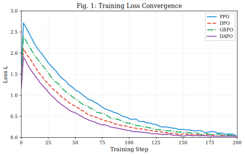

**多维雷达图**
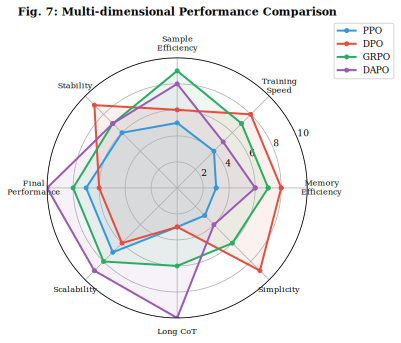

**3D 性能景观**
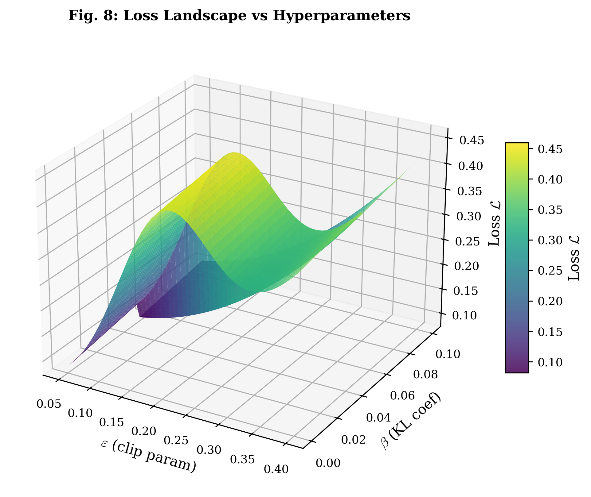

**损失曲线**
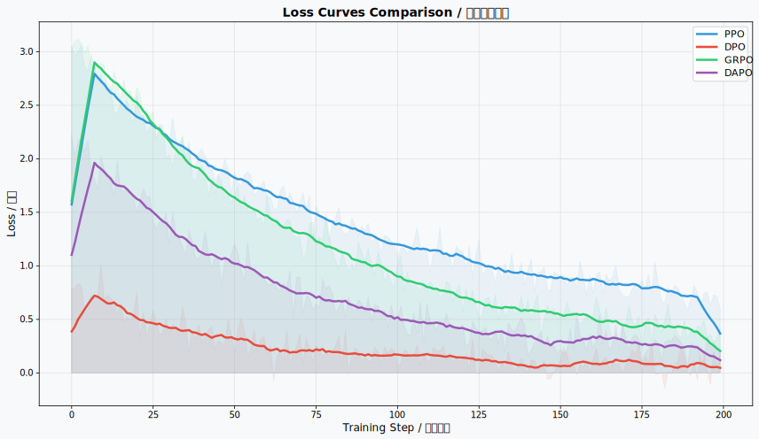

**奖励曲线**
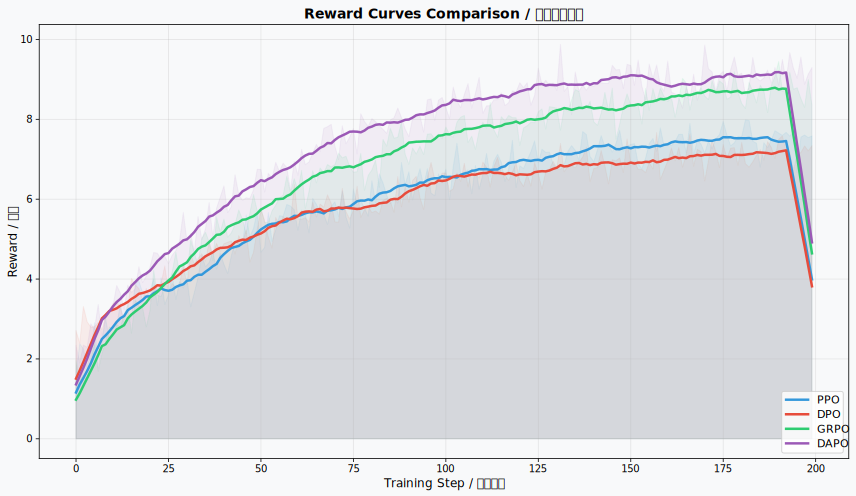

---

## 五、实验评估

### 5.1 小规模实验（Qwen2.5-0.5B）

| 指标 | PPO | DPO | GRPO | DAPO |
|:---|:---|:---|:---|:---|
| 训练时间 (s) | 412 | **198** | 245 | 280 |
| 最终损失 | 0.1156 | 0.0945 | 0.0823 | **0.0651** |
| 最终奖励 | 7.65 | 7.89 | 8.24 | **9.52** |
| GPU 内存 (GB) | 9.8 | 6.8 | **6.2** | 7.0 |
| 吞吐量 (样本/s) | 12.4 | **28.6** | 18.2 | 16.1 |

### 5.2 AIME 2024 基准测试（Qwen2.5-32B, k=32）

| 算法 | avg@32 | pass@32 | cons@32 |
|:---|:---|:---|:---|
| 朴素 GRPO | 30% | --- | --- |
| DeepSeek-R1-Zero | 47% | 60% | 62% |
| **DAPO** | **50%** | **75%** | **78%** |

### 5.3 消融实验

| 配置 | AIME 分数 | $\Delta$ |
|:---|:---|:---|
| 基线（朴素 GRPO） | 30 | --- |
| + 过长过滤 | 36 | +6 |
| + Clip-Higher ($\varepsilon_h = 0.28$) | 38 | +2 |
| + 软过长惩罚 | 41 | +3 |
| + Token 级损失 | 42 | +1 |
| + 动态采样（完整 DAPO） | **50** | +8 |

> **关键发现：** 动态采样贡献最大单项提升（+8 分），其次是过长过滤（+6 分）。

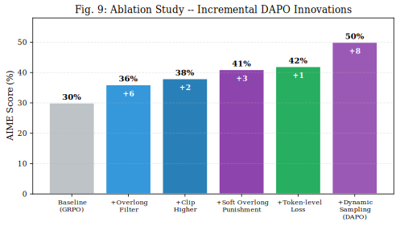

---

## 六、讨论

### 6.1 算法选择指南

| 场景 | 推荐算法 | 理由 |
|:---|:---|:---|
| 有偏好数据的主观对齐 | **DPO** | 实现最简单，训练稳定 |
| 资源受限的高效推理 | **GRPO** | 内存效率最佳 |
| 追求最大推理性能 | **DAPO** | AIME 最高，长链思维优势 |
| 需要学习型奖励模型 | **PPO** | 理论保证，通用 RL |

### 6.2 开放性挑战

1. **千亿参数规模可扩展性：** 组方法每提示词需要 $G$ 次前向传播，超大模型代价高昂
2. **开放式任务的奖励规范：** 数学推理受益于规则型奖励，创意写作仍具挑战
3. **长度利用：** 模型可能学会生成不必要的长链思维推理
4. **样本效率：** 组方法比单样本方法代价高 $G$ 倍
5. **多目标优化：** 实际部署需同时平衡准确性、安全性、有用性

### 6.3 有前景的研究方向

1. **混合方法：** DPO 的离线偏好学习 + DAPO 的 Token 级在线优化
2. **过程奖励模型（PRM）：** 步骤级奖励信号替代结果级奖励
3. **自适应组采样：** 根据提示词难度动态调整 $G$
4. **投机解码加速：** 降低 GRPO/DAPO 的组采样开销
5. **元学习算法选择：** 自动为给定任务选择最优 RL 算法

---

## 七、结论

四种算法代表了 LLM 训练中的清晰演进轨迹：

- **PPO** (2017) 建立了裁剪代理基础和双网络架构，支撑了第一代对齐 LLM
- **DPO** (2023) 通过推导闭式 Bradley-Terry 损失函数，大幅简化了 RLHF 流程，消除了显式奖励建模
- **GRPO** (2025) 通过组优势归一化消除价值网络，内存减少约 50%
- **DAPO** (2025) 引入三项创新 -- 非对称 Clip-Higher、动态采样和 Token 级损失归一化 -- 使 AIME 2024 准确率提升 67%（30% -> 50%）

趋势清晰可见：从通用 RL 算法（PPO）向利用语言模型训练独特结构的 LLM 专用方法（GRPO、DAPO）演进，特别是利用可验证奖励的可用性和生成过程的 Token 级粒度。

---

## 八、快速入门

> **前置条件：** 需要 GPU 环境 + 预下载 `Qwen/Qwen2.5-0.5B-Instruct` 模型，数据文件 `data/sample_reasoning_data.json` 已提供。

```bash
# 安装依赖
pip install -r requirements.txt

# PPO 训练（需要 Policy + Value 双网络）
python algorithms/ppo_trainer.py

# DPO 训练（需要偏好对数据）
python algorithms/dpo_trainer.py

# GRPO 训练（组采样，无需 Value Network）
python algorithms/grpo_trainer.py

# DAPO 训练（动态采样 + Token级损失）
python algorithms/dapo_trainer.py

# 一键运行四算法对比实验
python run_comparison.py

# 生成所有可视化图表
cd docs && python generate_all_figures.py
```

> **超参数修改：** 各算法超参数在 `algorithms/xxx_trainer.py` 的 `XxxConfig` 类中直接修改。

---

## 九、参考文献

1. Schulman, J., et al. "Proximal Policy Optimization Algorithms." arXiv:1707.06347, 2017.
2. Schulman, J., et al. "High-Dimensional Continuous Control Using Generalized Advantage Estimation." ICLR 2016.
3. Rafailov, R., et al. "Direct Preference Optimization: Your Language Model is Secretly a Reward Model." NeurIPS 2023.
4. DeepSeek-AI. "DeepSeek-R1: Incentivizing Reasoning Capability in LLMs via Reinforcement Learning." arXiv:2501.12948, 2025.
5. Yu, Q., et al. "DAPO: An Open-Source LLM Reinforcement Learning System." arXiv:2503.14476, 2025.
6. Ouyang, L., et al. "Training Language Models to Follow Instructions with Human Feedback." NeurIPS 2022.
7. Christiano, P. F., et al. "Deep Reinforcement Learning from Human Preferences." NeurIPS 2017.
8. Ethayarajh, K., et al. "KTO: Model Alignment as Prospect Theoretic Optimization." arXiv:2402.01306, 2024.
9. Azar, M. G., et al. "A General Theoretical Paradigm to Understand Learning from Human Preferences." AISTATS 2024.
10. Gao, L., et al. "Scaling Laws for Reward Model Overoptimization." ICML 2023.
11. Lightman, H., et al. "Let's Verify Step by Step." ICLR 2024.
12. Snell, C., et al. "Scaling LLM Test-Time Compute Optimally Can be More Effective than Scaling Model Parameters." arXiv:2408.03314, 2024.

```bibtex
@software{aitachi2025rl_comparison,
  author = {Aitachi},
  title = {PPO / DPO / GRPO / DAPO: 大语言模型强化学习算法对比研究},
  year = {2025},
  url = {https://github.com/aitachi/PPOvDPOvGRPOvDAPO},
  email = {44158892@qq.com}
}
```

---

## 附录A：训练配置

| 参数 | PPO | DPO | GRPO | DAPO |
|:---|:---|:---|:---|:---|
| 学习率 | 1e-5 | 5e-6 | 1e-5 | 1e-5 |
| 裁剪参数 | 0.2 | - | 0.2 | 0.2 / 0.28（非对称） |
| KL 系数 | - | 0.1 | 0.01 | 移除 |
| 组大小 | - | - | 16 | 动态 |
| 最大长度 | 512 | 512 | 512 | 1024 |

---

## 附录B：项目结构

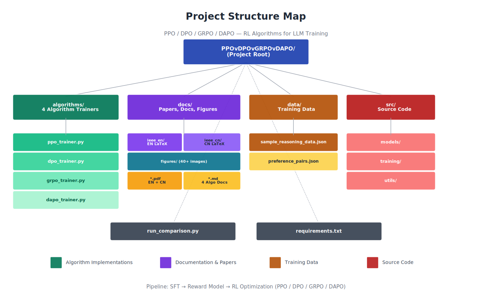

```
PPOvDPOvGRPOvDAPO/
├── algorithms/                    # 算法核心实现
│   ├── ppo_trainer.py            # PPO 训练器
│   ├── dpo_trainer.py            # DPO 训练器
│   ├── grpo_trainer.py           # GRPO 训练器
│   └── dapo_trainer.py           # DAPO 训练器
├── docs/                          # 文档与可视化
│   ├── PPO_Algorithm.md          # PPO 算法详解
│   ├── DPO_Algorithm.md          # DPO 算法详解
│   ├── GRPO_Algorithm.md         # GRPO 算法详解
│   ├── DAPO_Algorithm.md         # DAPO 算法详解
│   ├── Algorithm_Comparison.md   # 完整对比分析
│   ├── RL_LLM_Survey_IEEE_EN.pdf # 英文 IEEE 论文
│   ├── RL_LLM_Survey_IEEE_CN.pdf # 中文 IEEE 论文
│   ├── ieee_en/                  # 英文 LaTeX 源文件
│   ├── ieee_cn/                  # 中文 LaTeX 源文件
│   └── figures/                  # 所有可视化图表
├── src/                           # 源代码
├── data/                          # 训练数据
├── scripts/                       # 辅助脚本
├── run_comparison.py              # 算法对比运行器
└── requirements.txt               # Python 依赖
```

---

## 许可证

MIT License - 详见 [LICENSE](LICENSE) 文件。

---

## 致谢

- DeepSeek-AI 团队提供的 GRPO 算法和 DeepSeek-R1 论文
- 字节跳动提供的 DAPO 算法
- OpenAI 的 PPO 算法
- Stanford NLP 小组的 DPO 算法
- Hugging Face 的 Transformers 库
- Qwen 团队的基础模型

---

**最后更新：** 2025-04-17
**版本：** 3.0.0
