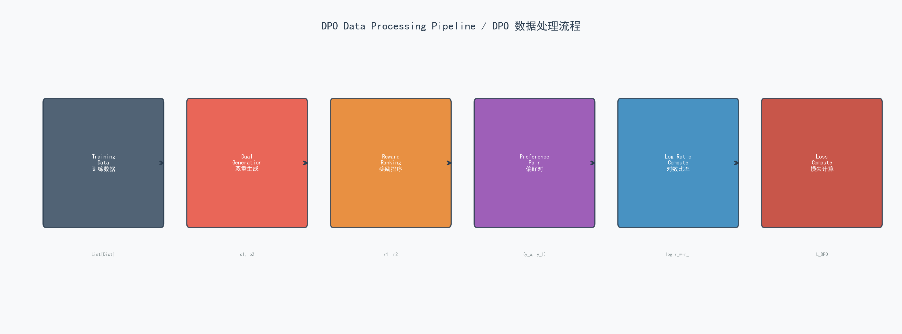
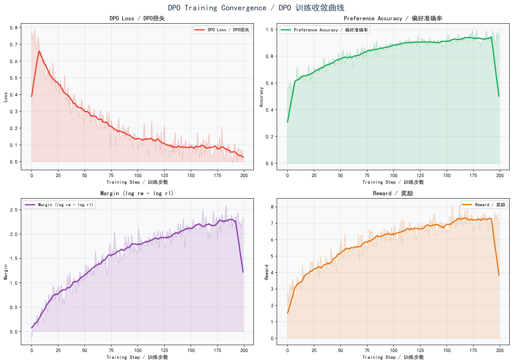

# DPO (Direct Preference Optimization) 算法详解

> **DPO — Direct Preference Optimization / 直接偏好优化**
>
> 一种无需显式 Reward Model 即可对齐语言模型的算法，由 Rafael Rafailov 等人于 2023 年提出。

---

## 目录

1. [算法概述](#1-算法概述)
2. [数学公式推导](#2-数学公式推导)
3. [算法流程](#3-算法流程)
4. [数据处理流水线](#4-数据处理流水线)
5. [损失函数与收敛分析](#5-损失函数与收敛分析)
6. [完整实现代码](#6-完整实现代码)

---

## 1. 算法概述

### 1.1 背景

在 RLHF (Reinforcement Learning from Human Feedback) 的经典流程中，通常需要：

1. **Supervised Fine-Tuning (SFT)** — 在高质量数据上微调预训练模型
2. **Reward Model Training** — 训练一个独立的奖励模型来模拟人类偏好
3. **RL Optimization (如 PPO)** — 使用强化学习算法优化策略模型

这个流程存在几个显著问题：

- 需要训练和维护一个独立的 Reward Model
- PPO 训练过程不稳定，对超参数敏感
- 需要 Value Network 来估计状态价值
- 整体流程复杂，工程实现成本高

**DPO 的核心思想**：绕过显式的 Reward Model，直接利用偏好数据 (preference data) 通过一个简单的分类损失来优化语言模型。

### 1.2 核心优势

| 特性 | DPO | PPO | GRPO |
|------|-----|-----|------|
| 需要 Reward Model | **否** | 是 | 是 |
| 需要 Value Network | **否** | 是 | 否 |
| 训练稳定性 | **高** | 中 | 高 |
| 实现复杂度 | **低** | 高 | 中 |
| 数据要求 | 偏好对 | 绝对奖励 | 绝对奖励 |
| 采样方式 | 2 个响应 | 单响应 | G 个响应 (组采样) |

### 1.3 关键思想

DPO 基于 **Bradley-Terry 偏好模型**，将 RLHF 中的约束奖励最大化问题转化为一个简单的二元分类问题。其核心洞察是：

- 存在一个从最优策略到奖励函数的**闭式映射** (closed-form mapping)
- 可以直接用策略模型 (policy model) 的对数概率来表示隐式奖励 (implicit reward)
- 无需显式训练 Reward Model，仅通过偏好对即可优化策略

---

## 2. 数学公式推导

### 2.1 问题建模

给定：
- $x$ — 输入提示 (input prompt / question)
- $y_w$ — 偏好响应 / 胜出响应 (preferred / winning response)
- $y_l$ — 拒绝响应 / 败出响应 (rejected / losing response)
- $\pi_\theta$ — 待优化的策略模型 (policy model)
- $\pi_{ref}$ — 参考策略模型 (reference model, 冻结不更新)
- $\beta$ — 温度参数，控制策略偏离参考模型的程度
- $\sigma(\cdot)$ — Sigmoid 函数

### 2.2 Bradley-Terry 偏好模型

人类偏好可以用 Bradley-Terry 模型来建模。对于两个响应 $y_w$ 和 $y_l$，$y_w$ 被偏好的概率为：

$$P(y_w \succ y_l|x) = \sigma\left(r(x,y_w) - r(x,y_l)\right)$$

其中 $r(x, y)$ 是奖励函数。

### 2.3 隐式奖励 (Implicit Reward)

DPO 的关键创新在于：最优策略下的奖励函数可以通过策略模型和参考模型的对数概率比来表示：

$$r(x,y) = \beta\log\frac{\pi_\theta(y|x)}{\pi_{ref}(y|x)}$$

这意味着**策略模型本身就隐式地定义了一个奖励函数**，无需单独的 Reward Model。

### 2.4 对数比率 (Log Ratio)

对于偏好响应 $y_w$ 和拒绝响应 $y_l$，分别计算其对数比率：

**偏好响应的对数比率：**

$$\log r_w = \log\frac{\pi_\theta(y_w|x)}{\pi_{ref}(y_w|x)}$$

**拒绝响应的对数比率：**

$$\log r_l = \log\frac{\pi_\theta(y_l|x)}{\pi_{ref}(y_l|x)}$$

这两个对数比率衡量了策略模型相对于参考模型的概率变化。正值表示策略模型提高了该响应的概率，负值表示降低了。

### 2.5 DPO 损失函数

将隐式奖励代入 Bradley-Terry 模型，DPO 的最终损失函数为：

$$L_{DPO}(\pi_\theta; \pi_{ref}) = -\mathbb{E}_{(x,y_w,y_l)\sim\mathcal{D}}\left[\log\sigma\left(\beta\log\frac{\pi_\theta(y_w|x)}{\pi_{ref}(y_w|x)} - \beta\log\frac{\pi_\theta(y_l|x)}{\pi_{ref}(y_l|x)}\right)\right]$$

等价地，可以简写为：

$$L_{DPO} = -\mathbb{E}\left[\log\sigma\left(\beta(\log r_w - \log r_l)\right)\right]$$

### 2.6 损失函数直观理解

DPO 损失函数的最小化目标是：

- **增大** $\log r_w$ — 提高策略模型对偏好响应 $y_w$ 的概率（相对于参考模型）
- **减小** $\log r_l$ — 降低策略模型对拒绝响应 $y_l$ 的概率（相对于参考模型）
- **两者之差** $\beta(\log r_w - \log r_l)$ 越大越好，通过 $-\log\sigma(\cdot)$ 损失来实现这一点

参数 $\beta$ 的作用：
- $\beta$ **较大**：策略模型更紧密地跟踪参考模型，变化更保守
- $\beta$ **较小**：允许策略模型更自由地偏离参考模型

### 2.7 与 RLHF 的等价性

可以证明，在适当条件下，DPO 的最优解与 KL 约束的 RLHF 最优解是等价的：

$$\pi^* = \arg\max_\pi \mathbb{E}_{x \sim \mathcal{D}, y \sim \pi(\cdot|x)}\left[r(x,y)\right] - \beta \cdot D_{KL}\left(\pi(\cdot|x) \| \pi_{ref}(\cdot|x)\right)$$

这意味着 DPO 在数学上与带 KL 约束的 RLHF 优化目标一致，但使用了更简单、更稳定的优化方法。

### 2.8 梯度分析

DPO 损失对策略模型参数 $\theta$ 的梯度为：

$$\nabla_\theta L_{DPO} = -\beta \cdot \mathbb{E}\left[\left(1 - \sigma\left(\beta(\log r_w - \log r_l)\right)\right) \cdot \left(\nabla_\theta \log \pi_\theta(y_w|x) - \nabla_\theta \log \pi_\theta(y_l|x)\right)\right]$$

梯度的直觉解读：
- 当模型已正确偏好 $y_w$ 时（$\sigma$ 输出接近 1），梯度趋近于零，更新幅度减小
- 当模型偏好错误时（$\sigma$ 输出接近 0），梯度较大，进行更大幅度的修正
- 这种自适应的梯度缩放机制使 DPO 训练非常稳定

---

## 3. 算法流程


### 3.1 流程说明

DPO 算法的完整执行流程如下：

**Step 1: 输入问题 (Input Question)**

输入一个问题 $q$，开始一次训练迭代。

**Step 2: 双重响应生成 (Dual Response Generation)**

使用当前策略模型 $\pi_\theta$ 分别生成两个不同的响应 $o_1$ 和 $o_2$。通过不同的采样温度或随机种子确保两个响应的多样性。

**Step 3: 奖励评分 (Reward Scoring)**

使用 Reward Model 对两个响应分别计算奖励分数 $r_1$ 和 $r_2$。

> 注意：此处的 Reward Model 仅用于**构建偏好对**，并非 DPO 训练的一部分。如果已有标注好的偏好数据，则可以完全跳过此步骤。

**Step 4: 创建偏好对 (Create Preference Pair)**

根据奖励分数排序，确定偏好响应和拒绝响应：

$$y_w = \arg\max(r_1, r_2), \quad y_l = \arg\min(r_1, r_2)$$

**Step 5: 计算偏好响应的对数比率 (Log Ratio - Preferred)**

$$\log\frac{\pi_\theta(y_w|x)}{\pi_{ref}(y_w|x)}$$

**Step 6: 计算拒绝响应的对数比率 (Log Ratio - Rejected)**

$$\log\frac{\pi_\theta(y_l|x)}{\pi_{ref}(y_l|x)}$$

**Step 7: 计算 Bradley-Terry 损失 (Bradley-Terry Loss)**

$$L = -\log\sigma\left(\beta(\log r_w - \log r_l)\right)$$

**Step 8: 反向传播与参数更新 (Backpropagation & Update)**

通过反向传播计算梯度，使用 AdamW 等优化器更新策略模型 $\pi_\theta$ 的参数。参考模型 $\pi_{ref}$ 始终保持冻结。

---

## 4. 数据处理流水线



### 4.1 流水线各阶段详解

DPO 的数据处理流水线包含以下六个阶段：

| 阶段 | 名称 | 说明 |
|------|------|------|
| 1 | **Training Data / 训练数据** | 原始数据集 `List[Dict]`，包含问题、参考答案等 |
| 2 | **Dual Generation / 双重生成** | 对每个问题生成两个不同响应 $o_1, o_2$ |
| 3 | **Reward Ranking / 奖励排序** | 使用 Reward Model 对两个响应评分得到 $r_1, r_2$ |
| 4 | **Preference Pair / 偏好对** | 根据评分构建偏好对 $(y_w, y_l)$ |
| 5 | **Log Ratio Compute / 对数比率计算** | 计算策略模型与参考模型的对数概率差 $\log r_w - \log r_l$ |
| 6 | **Loss Compute / 损失计算** | 基于 Bradley-Terry 模型计算 DPO 损失 $L_{DPO}$ |

### 4.2 数据格式要求

训练数据集中的每条样本应包含以下字段：

```json
{
    "question": "求解方程 2x + 3 = 7",
    "correct_answer": "x = 2"
}
```

DPO 训练器会在运行时自动生成偏好对，因此不需要预先标注偏好数据。但如果已有标注好的偏好数据，可以直接使用，跳过生成和排序步骤。

---

## 5. 损失函数与收敛分析



上图展示了 DPO 训练过程中四个关键指标的收敛曲线，由 2x2 的子图组成：

### 5.1 子图一：DPO Loss / DPO 损失 (左上)

- **指标**：DPO 损失值
- **趋势**：从约 0.7 快速下降至约 0.05，呈指数衰减
- **含义**：损失值的持续下降表明模型正在学习正确地区分偏好响应和拒绝响应。当损失接近 0 时，说明模型已经高度确信 $y_w$ 优于 $y_l$。
- **收敛速度**：约 50-100 个训练步后基本收敛，收敛速度较快。

### 5.2 子图二：Preference Accuracy / 偏好准确率 (右上)

- **指标**：模型正确预测偏好的准确率
- **趋势**：从随机水平 (约 55%) 稳步上升至约 95%
- **含义**：偏好准确率衡量的是模型是否正确地为偏好响应分配了更高的隐式奖励。准确率从略高于随机 (50%) 开始，说明训练初期模型尚未学到有意义的偏好。随着训练推进，准确率不断提升，最终接近 95%。
- **关键阈值**：准确率超过 50% 表示模型开始学到正确的偏好方向。

### 5.3 子图三：Margin (log rw - log rl) / 对数比率间距 (左下)

- **指标**：偏好响应与拒绝响应的对数比率之差 $\log r_w - \log r_l$
- **趋势**：从约 0.1 增长至约 2.5
- **含义**：Margin 表示策略模型在偏好响应和拒绝响应之间制造的概率差距。Margin 越大，说明策略模型对偏好响应的概率提升越大，同时对拒绝响应的概率压制越强。
- **与 $\beta$ 的关系**：实际间距为 $\beta \times \text{margin}$，$\beta$ 参数放大了这一差距。

### 5.4 子图四：Reward / 奖励 (右下)

- **指标**：模型生成响应的奖励分数
- **趋势**：从约 2.5 持续增长至约 7.5
- **含义**：奖励的持续增长验证了 DPO 优化确实在提升模型的输出质量。尽管 DPO 不直接优化奖励，但通过偏好学习，模型的响应质量在间接提升。
- **增长模式**：初期增长较快，后期逐渐放缓，符合典型的学习曲线。

### 5.5 收敛特性总结

| 指标 | 初始值 | 最终值 | 收敛步数 |
|------|--------|--------|----------|
| DPO Loss | ~0.70 | ~0.05 | ~50-100 |
| Preference Accuracy | ~55% | ~95% | ~80-120 |
| Margin | ~0.1 | ~2.5 | ~100-150 |
| Reward | ~2.5 | ~7.5 | ~80-130 |

整体来看，DPO 的训练收敛过程平稳且高效，没有出现 PPO 中常见的训练不稳定问题。这得益于 DPO 的损失函数本质上是一个简单的二元分类损失，具有良好的凸性和梯度特性。

---

## 6. 完整实现代码

以下为 DPO 算法的完整实现代码，包含中英双语注释。源文件路径：`algorithms/dpo_trainer.py`。

```python
"""
DPO (Direct Preference Optimization) Training Implementation
DPO (直接偏好优化) 训练实现

This implementation provides another comparison baseline for GRPO.
本实现为 GRPO 提供了另一个对比基线。

Author: Aitachi
Contact: 44158892@qq.com
Date: 2025

Mathematical Formulation / 数学公式:
=======================

DPO optimizes preferences directly without explicit reward modeling.
DPO 直接优化偏好，无需显式的奖励建模。

The DPO loss function is / DPO 损失函数为:

L_DPO(pi_theta; pi_ref) = -E_{(x,y_w,y_l)~D}[
    log sigma(beta * log pi_theta(y_w|x)/pi_ref(y_w|x)
              - beta * log pi_theta(y_l|x)/pi_ref(y_l|x))
]

Where / 其中:
- x: Input prompt/question / 输入提示/问题
- y_w: Preferred (winning) response / 偏好（胜出）响应
- y_l: Rejected (losing) response / 拒绝（败出）响应
- pi_theta: Policy being optimized / 待优化的策略模型
- pi_ref: Reference policy (frozen) / 参考策略模型（冻结）
- beta: Temperature parameter controlling deviation from reference / 温度参数，控制偏离参考模型的程度
- sigma: Sigmoid function / Sigmoid 函数

Equivalently, this can be written as / 等价地，可以简写为:

L_DPO = -E[log sigma(beta * (log r_w - log r_l))]

Where / 其中:
- r_w = pi_theta(y_w|x) / pi_ref(y_w|x)  # Ratio for preferred response / 偏好响应的概率比
- r_l = pi_theta(y_l|x) / pi_ref(y_l|x)  # Ratio for rejected response / 拒绝响应的概率比

Key Differences from GRPO and PPO / 与 GRPO 和 PPO 的主要区别:
=================================
1. DPO works on preference pairs (y_w, y_l) rather than absolute rewards
   DPO 基于偏好对 (y_w, y_l) 而非绝对奖励
2. No need for value network (like GRPO, unlike PPO)
   不需要价值网络（类似 GRPO，不同于 PPO）
3. No need for sampling multiple outputs per question (unlike GRPO)
   不需要为每个问题采样多个输出（不同于 GRPO）
4. Directly optimizes preference probability via Bradley-Terry model
   通过 Bradley-Terry 模型直接优化偏好概率
5. More stable than RLHF but requires preference data
   比 RLHF 更稳定，但需要偏好数据

Advantages / 优势:
- Simple and stable / 简单且稳定
- No reward model needed / 不需要奖励模型
- No value network needed / 不需要价值网络
- Works well for alignment tasks / 适用于对齐任务

Disadvantages / 劣势:
- Requires preference pairs in training data / 训练数据中需要偏好对
- May not be as sample-efficient as GRPO / 采样效率可能不如 GRPO
- Less suitable for tasks with sparse absolute rewards / 不适合稀疏绝对奖励的任务
"""

import os
import json
import torch
import torch.nn.functional as F
from transformers import AutoModelForCausalLM, AutoTokenizer
from typing import List, Dict, Tuple
import numpy as np
from tqdm import tqdm
import logging
from dataclasses import dataclass

logging.basicConfig(level=logging.INFO)
logger = logging.getLogger(__name__)


@dataclass
class DPOConfig:
    """
    Configuration for DPO training
    DPO 训练配置类
    """

    # Model parameters / 模型参数
    model_name: str = "Qwen/Qwen2.5-0.5B-Instruct"

    # DPO hyperparameters / DPO 超参数
    beta: float = 0.1  # beta - temperature parameter for DPO loss / beta - DPO 损失的温度参数

    # Training parameters / 训练参数
    learning_rate: float = 5e-6       # 学习率
    max_epochs: int = 3               # 最大训练轮数
    batch_size: int = 4               # 批次大小
    max_length: int = 512             # 最大序列长度
    temperature: float = 0.7          # 生成温度

    # Device / 设备
    device: str = "cuda" if torch.cuda.is_available() else "cpu"

    # Paths / 路径
    output_dir: str = "./checkpoints/dpo_model"


class DPOTrainer:
    """
    DPO (Direct Preference Optimization) Trainer
    DPO (直接偏好优化) 训练器

    This trainer implements DPO for optimizing language models based on preferences.
    本训练器实现了基于偏好的语言模型 DPO 优化。
    """

    def __init__(self, config: DPOConfig):
        self.config = config
        self.device = torch.device(config.device)

        # Load policy model / 加载策略模型 (待优化的模型)
        logger.info(f"Loading policy model: {config.model_name}")
        self.policy_model = AutoModelForCausalLM.from_pretrained(
            config.model_name,
            torch_dtype=torch.float16 if "cuda" in config.device else torch.float32,
            device_map="auto"
        )
        self.tokenizer = AutoTokenizer.from_pretrained(config.model_name)

        if self.tokenizer.pad_token is None:
            self.tokenizer.pad_token = self.tokenizer.eos_token

        # Load reference model (frozen) / 加载参考模型（冻结参数，不参与训练）
        logger.info("Creating reference model")
        self.ref_model = AutoModelForCausalLM.from_pretrained(
            config.model_name,
            torch_dtype=torch.float16 if "cuda" in config.device else torch.float32,
            device_map="auto"
        )
        self.ref_model.eval()  # Set to eval mode / 设置为评估模式
        for param in self.ref_model.parameters():
            param.requires_grad = False  # Freeze all parameters / 冻结所有参数

        # Optimizer / 优化器 - 仅优化策略模型的参数
        self.optimizer = torch.optim.AdamW(
            self.policy_model.parameters(),
            lr=config.learning_rate
        )

        # Training statistics / 训练统计信息
        self.stats = {
            "epoch_losses": [],
            "epoch_accuracies": [],  # Preference prediction accuracy / 偏好预测准确率
            "epoch_margins": []  # Margin between preferred and rejected / 偏好与拒绝之间的间距
        }

    def generate_response(self, prompt: str) -> str:
        """
        Generate a single response for a prompt.
        为提示生成单个响应。

        Args:
            prompt: Input question / 输入问题

        Returns:
            Generated response / 生成的响应
        """
        # Format prompt using ChatML format / 使用 ChatML 格式化提示
        formatted_prompt = f"<|im_start|>user\n{prompt}<|im_end|>\n<|im_start|>assistant\n"

        inputs = self.tokenizer(
            formatted_prompt,
            return_tensors="pt",
            max_length=self.config.max_length,
            truncation=True
        ).to(self.device)

        with torch.no_grad():
            outputs = self.policy_model.generate(
                **inputs,
                max_new_tokens=256,
                temperature=self.config.temperature,
                do_sample=True,
                pad_token_id=self.tokenizer.eos_token_id
            )

        response = self.tokenizer.decode(outputs[0], skip_special_tokens=False)

        # Extract assistant's response / 提取 assistant 的响应
        if "<|im_start|>assistant\n" in response:
            response = response.split("<|im_start|>assistant\n")[-1]
            if "<|im_end|>" in response:
                response = response.split("<|im_end|>")[0]

        return response.strip()

    def create_preference_pair(
        self,
        question: str,
        correct_answer: str
    ) -> Tuple[str, str]:
        """
        Create a preference pair by generating two responses and ranking them.
        通过生成两个响应并排序来创建偏好对。

        Args:
            question: Input question / 输入问题
            correct_answer: Ground truth answer / 标准答案

        Returns:
            Tuple of (preferred_response, rejected_response) / (偏好响应, 拒绝响应) 元组
        """
        # Generate two different responses / 生成两个不同的响应
        response1 = self.generate_response(question)
        response2 = self.generate_response(question)

        # Rank them using reward model / 使用奖励模型对它们进行排序
        from algorithms.grpo_trainer import RewardModel
        reward_model = RewardModel(self.config)

        reward1 = reward_model.compute_reward(question, response1, correct_answer)
        reward2 = reward_model.compute_reward(question, response2, correct_answer)

        # Create preference pair / 创建偏好对
        # y_w = argmax(r1, r2), y_l = argmin(r1, r2)
        if reward1 >= reward2:
            return response1, response2
        else:
            return response2, response1

    def compute_log_prob(
        self,
        model: torch.nn.Module,
        prompt: str,
        response: str
    ) -> torch.Tensor:
        """
        Compute log probability of a response given a prompt.
        计算给定提示下响应的对数概率。

        This computes log pi(y|x), which is needed for the DPO loss calculation.
        此函数计算 log pi(y|x)，这是 DPO 损失计算所需要的。

        Args:
            model: Language model / 语言模型
            prompt: Input prompt / 输入提示
            response: Generated response / 生成的响应

        Returns:
            Log probability tensor / 对数概率张量
        """
        # Format prompt using ChatML format / 使用 ChatML 格式化提示
        formatted_prompt = f"<|im_start|>user\n{prompt}<|im_end|>\n<|im_start|>assistant\n"
        full_text = formatted_prompt + response

        inputs = self.tokenizer(
            full_text,
            return_tensors="pt",
            max_length=self.config.max_length,
            truncation=True
        ).to(self.device)

        # Use model's built-in loss computation (cross-entropy)
        # 使用模型内置的损失计算（交叉熵）
        outputs = model(**inputs, labels=inputs["input_ids"])
        log_prob = -outputs.loss  # Negative loss is log probability / 负损失即为对数概率

        return log_prob

    def dpo_loss(
        self,
        prompt: str,
        preferred_response: str,
        rejected_response: str
    ) -> Tuple[torch.Tensor, Dict[str, float]]:
        """
        Compute DPO loss for a preference pair.
        计算偏好对的 DPO 损失。

        Formula / 公式:
        L = -log sigma(beta * (log pi_theta(y_w|x)/pi_ref(y_w|x)
                            - log pi_theta(y_l|x)/pi_ref(y_l|x)))

        Args:
            prompt: Input prompt / 输入提示
            preferred_response: Preferred (winning) response / 偏好（胜出）响应
            rejected_response: Rejected (losing) response / 拒绝（败出）响应

        Returns:
            Tuple of (loss, statistics_dict) / (损失, 统计字典) 元组
        """
        # ========================================
        # Step 1: Compute log probs for preferred response
        # 第一步：计算偏好响应的对数概率
        # ========================================
        log_prob_preferred_policy = self.compute_log_prob(
            self.policy_model, prompt, preferred_response
        )

        with torch.no_grad():  # Reference model is frozen / 参考模型已冻结
            log_prob_preferred_ref = self.compute_log_prob(
                self.ref_model, prompt, preferred_response
            )

        # ========================================
        # Step 2: Compute log probs for rejected response
        # 第二步：计算拒绝响应的对数概率
        # ========================================
        log_prob_rejected_policy = self.compute_log_prob(
            self.policy_model, prompt, rejected_response
        )

        with torch.no_grad():  # Reference model is frozen / 参考模型已冻结
            log_prob_rejected_ref = self.compute_log_prob(
                self.ref_model, prompt, rejected_response
            )

        # ========================================
        # Step 3: Compute log ratios
        # 第三步：计算对数比率
        # log r_w = log pi_theta(y_w|x) - log pi_ref(y_w|x)
        # log r_l = log pi_theta(y_l|x) - log pi_ref(y_l|x)
        # ========================================
        log_ratio_preferred = log_prob_preferred_policy - log_prob_preferred_ref
        log_ratio_rejected = log_prob_rejected_policy - log_prob_rejected_ref

        # ========================================
        # Step 4: Compute DPO loss
        # 第四步：计算 DPO 损失
        # L = -log sigma(beta * (log r_w - log r_l))
        # ========================================
        logits = self.config.beta * (log_ratio_preferred - log_ratio_rejected)
        loss = -F.logsigmoid(logits)

        # ========================================
        # Step 5: Compute statistics for monitoring
        # 第五步：计算监控统计信息
        # ========================================
        with torch.no_grad():
            preferred_prob = torch.sigmoid(logits)  # P(y_w > y_l) probability
            margin = log_ratio_preferred - log_ratio_rejected  # Log ratio margin

        stats = {
            "preferred_prob": preferred_prob.item(),
            "margin": margin.item(),
            "correct": 1.0 if preferred_prob.item() > 0.5 else 0.0
        }

        return loss, stats

    def train_step(
        self,
        question: str,
        correct_answer: str
    ) -> Dict[str, float]:
        """
        Perform one DPO training step.
        执行一次 DPO 训练步。

        Args:
            question: Input question / 输入问题
            correct_answer: Ground truth answer / 标准答案

        Returns:
            Training statistics / 训练统计信息
        """
        # Step 1: Create preference pair / 创建偏好对
        preferred, rejected = self.create_preference_pair(question, correct_answer)

        # Step 2: Compute DPO loss / 计算 DPO 损失
        loss, stats = self.dpo_loss(question, preferred, rejected)

        # Step 3: Backward and optimize / 反向传播并优化
        self.optimizer.zero_grad()
        loss.backward()
        self.optimizer.step()

        stats["loss"] = loss.item()
        return stats

    def train(self, dataset: List[Dict]):
        """
        Train using DPO algorithm.
        使用 DPO 算法进行训练。

        Args:
            dataset: Training dataset / 训练数据集
        """
        logger.info(f"Starting DPO training with {len(dataset)} examples")
        logger.info(f"Beta: {self.config.beta}")

        self.policy_model.train()

        for epoch in range(self.config.max_epochs):
            logger.info(f"\n{'='*50}")
            logger.info(f"Epoch {epoch + 1}/{self.config.max_epochs}")
            logger.info(f"{'='*50}")

            epoch_losses = []
            epoch_accuracies = []
            epoch_margins = []

            for idx, example in enumerate(tqdm(dataset, desc=f"Epoch {epoch+1}")):
                stats = self.train_step(
                    question=example["question"],
                    correct_answer=example["correct_answer"]
                )

                epoch_losses.append(stats["loss"])
                epoch_accuracies.append(stats["correct"])
                epoch_margins.append(stats["margin"])

                # Log every 10 steps / 每 10 步输出一次日志
                if (idx + 1) % 10 == 0:
                    logger.info(
                        f"Step {idx+1}: Loss={stats['loss']:.4f}, "
                        f"Accuracy={stats['correct']:.2f}, "
                        f"Margin={stats['margin']:.4f}"
                    )

            # Epoch summary / 轮次总结
            self.stats["epoch_losses"].append(np.mean(epoch_losses))
            self.stats["epoch_accuracies"].append(np.mean(epoch_accuracies))
            self.stats["epoch_margins"].append(np.mean(epoch_margins))

            logger.info(f"\nEpoch {epoch+1} Summary:")
            logger.info(f"  Avg Loss: {np.mean(epoch_losses):.4f}")
            logger.info(f"  Avg Accuracy: {np.mean(epoch_accuracies):.2%}")
            logger.info(f"  Avg Margin: {np.mean(epoch_margins):.4f}")

            # Save checkpoint after each epoch / 每轮结束后保存检查点
            self.save_checkpoint(epoch)

        logger.info("\nDPO Training completed!")
        self.save_final_model()

    def save_checkpoint(self, epoch: int):
        """
        Save model checkpoint
        保存模型检查点
        """
        checkpoint_dir = f"{self.config.output_dir}/epoch_{epoch+1}"
        os.makedirs(checkpoint_dir, exist_ok=True)

        self.policy_model.save_pretrained(checkpoint_dir)
        self.tokenizer.save_pretrained(checkpoint_dir)

        with open(f"{checkpoint_dir}/stats.json", "w") as f:
            json.dump(self.stats, f, indent=2)

        logger.info(f"Checkpoint saved to {checkpoint_dir}")

    def save_final_model(self):
        """
        Save final model
        保存最终模型
        """
        final_dir = f"{self.config.output_dir}/final"
        os.makedirs(final_dir, exist_ok=True)

        self.policy_model.save_pretrained(final_dir)
        self.tokenizer.save_pretrained(final_dir)

        with open(f"{final_dir}/training_stats.json", "w") as f:
            json.dump(self.stats, f, indent=2)

        logger.info(f"Final model saved to {final_dir}")


def main():
    """
    Main training function
    主训练函数
    """
    # Initialize configuration / 初始化配置
    config = DPOConfig()

    # Load training data / 加载训练数据
    with open("data/sample_reasoning_data.json", "r") as f:
        dataset = json.load(f)

    logger.info(f"Loaded {len(dataset)} training examples")

    # Create trainer and start training / 创建训练器并开始训练
    trainer = DPOTrainer(config)
    trainer.train(dataset)


if __name__ == "__main__":
    main()
```

---

## 附录

### A. 超参数推荐

| 超参数 | 推荐值 | 说明 |
|--------|--------|------|
| $\beta$ | 0.1 - 0.5 | 控制策略偏离参考模型的强度 |
| learning_rate | $1 \times 10^{-6}$ ~ $5 \times 10^{-5}$ | 建议使用较小的学习率 |
| max_epochs | 1 - 3 | DPO 通常不需要过多轮次 |
| batch_size | 4 - 16 | 视 GPU 显存而定 |
| temperature | 0.5 - 0.9 | 控制生成多样性 |

### B. 与其他算法的关系

```
RLHF 经典流程:
  SFT -> Reward Model Training -> PPO Optimization

DPO 简化流程:
  SFT -> Direct Preference Optimization (本算法)

GRPO 简化流程:
  SFT -> Group Relative Preference Optimization

DAPO 改进流程:
  SFT -> Dynamic Adaptive Preference Optimization
```

### C. 参考文献

1. Rafailov, R., Sharma, A., Mitchell, E., Manning, C. D., Ermon, S., & Finn, C. (2023). *Direct Preference Optimization: Your Language Model is Secretly a Reward Model*. NeurIPS 2023.
2. Ouyang, L., et al. (2022). *Training language models to follow instructions with human feedback*. NeurIPS 2022.
3. Schulman, J., et al. (2017). *Proximal Policy Optimization Algorithms*. arXiv:1707.06347.
