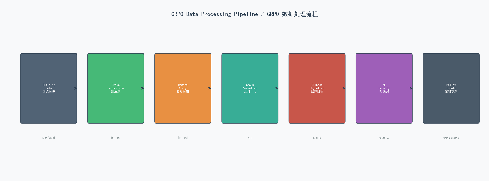
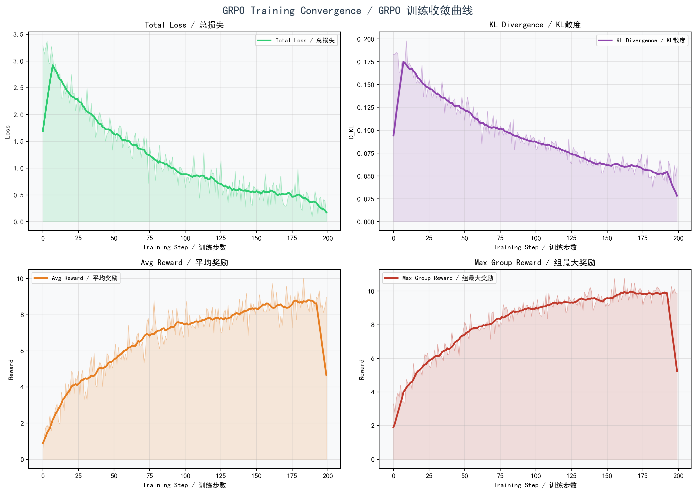

# GRPO (Group Relative Policy Optimization) 算法详解

## 1. 概述 / Overview

**GRPO (Group Relative Policy Optimization)** 是 DeepSeek-R1 论文中提出的一种高效强化学习算法，用于激励大语言模型 (LLM) 的推理能力。GRPO 源自 PPO (Proximal Policy Optimization) 的思想，但通过 **组内相对奖励归一化** 的方式消除了对独立 Critic（价值函数）网络的依赖，大幅降低了训练的显存和计算开销。

### 核心思想

在传统 PPO 中，Advantage（优势函数）的计算需要一个与 Policy Network（策略网络）规模相当的 Value Network 来估计基线 (baseline)。GRPO 的创新在于：

- **不需要 Critic 网络**：对于同一个问题 $q$，从当前策略 $\pi_{\theta_{old}}$ 中采样 $G$ 个输出 $\{o_1, o_2, \ldots, o_G\}$，然后利用这组输出的奖励统计量（均值和标准差）来计算相对优势。
- **组内归一化 (Group Normalization)**：将奖励在同一组内进行标准化，得到相对优势 $\hat{A}_i$，使得高奖励输出被强化、低奖励输出被抑制。
- **KL 散度约束**：引入相对于参考策略 $\pi_{ref}$ 的 KL 散度惩罚，防止策略偏离初始模型过远，保持生成多样性。

### 与 PPO 的对比

| 特性 | PPO | GRPO |
|------|-----|------|
| Advantage 计算 | $A_t = \sum_{l=0}^{\infty} \gamma^l r_{t+l} - V(s_t)$ | $\hat{A}_i = \frac{r_i - \text{mean}(\mathbf{r})}{\text{std}(\mathbf{r})}$ |
| Critic 网络 | 需要 | 不需要 |
| 显存占用 | 高 (Policy + Critic + Ref) | 中 (Policy + Ref) |
| 奖励来源 | Reward Model 或规则 | 规则型奖励为主 |
| 样本效率 | 单样本时序 | 组内多样本并行 |

---

## 2. 数学公式 / Mathematical Formulation

### 2.1 GRPO 目标函数 (Objective Function)

GRPO 的优化目标为：

$$J_{GRPO}(\theta) = \mathbb{E}_{q\sim P(Q), \{o_i\}_{i=1}^G \sim \pi_{\theta_{old}}}\left[\frac{1}{G}\sum_{i=1}^G \min\left(\frac{\pi_\theta(o_i|q)}{\pi_{\theta_{old}}(o_i|q)}\hat{A}_i, \text{clip}\left(\frac{\pi_\theta(o_i|q)}{\pi_{\theta_{old}}(o_i|q)}, 1-\epsilon, 1+\epsilon\right)\hat{A}_i\right) - \beta D_{KL}(\pi_\theta \| \pi_{ref})\right]$$

其中各符号含义如下：

| 符号 | 含义 |
|------|------|
| $\theta$ | 当前策略 (Current Policy) 参数 |
| $\theta_{old}$ | 旧策略 (Old Policy) 参数，生成样本时的策略快照 |
| $q$ | 输入问题 / 提示词 (Question / Prompt)，从分布 $P(Q)$ 中采样 |
| $o_i$ | 第 $i$ 个生成输出 (Output Sample) |
| $G$ | 组大小 (Group Size)，每个问题生成的样本数量 |
| $\epsilon$ | 裁剪参数 (Clipping Parameter)，通常取 0.2 |
| $\beta$ | KL 散度系数 (KL Coefficient)，控制正则化强度 |
| $\hat{A}_i$ | 第 $i$ 个样本的组归一化优势 (Group Advantage) |

### 2.2 组优势函数 (Group Advantage)

对于同一个问题 $q$ 生成的 $G$ 个输出，其奖励为 $\{r_1, r_2, \ldots, r_G\}$，组优势的计算方式为：

$$\hat{A}_i = \frac{r_i - \text{mean}(\{r_1, r_2, \ldots, r_G\})}{\text{std}(\{r_1, r_2, \ldots, r_G\})}$$

**直觉理解**：

- 若 $r_i > \text{mean}(\mathbf{r})$，则 $\hat{A}_i > 0$，该输出的概率将被提升。
- 若 $r_i < \text{mean}(\mathbf{r})$，则 $\hat{A}_i < 0$，该输出的概率将被降低。
- 除以标准差确保了优势值的数值稳定性，防止梯度爆炸。

### 2.3 策略比率 (Policy Ratio)

$$r_i(\theta) = \frac{\pi_\theta(o_i|q)}{\pi_{\theta_{old}}(o_i|q)}$$

该比率衡量当前策略 $\pi_\theta$ 相对于采样策略 $\pi_{\theta_{old}}$ 对输出 $o_i$ 的概率变化。当 $r_i(\theta) > 1$ 时，当前策略比旧策略更倾向于生成该输出。

### 2.4 裁剪目标 (Clipped Objective)

$$L^{clip}(\theta) = \min\left(r_i(\theta) \hat{A}_i,\; \text{clip}(r_i(\theta), 1-\epsilon, 1+\epsilon) \hat{A}_i\right)$$

裁剪机制的作用：

- **防止过大更新**：当 $r_i(\theta)$ 偏离 1 太远时，裁剪会截断梯度，保证策略更新的稳定性。
- **信任区域 (Trust Region)**：等效于限制策略在 $[1-\epsilon, 1+\epsilon]$ 的范围内更新，形成隐式的信任区域。

### 2.5 KL 散度惩罚 (KL Divergence Penalty)

GRPO 使用以下近似 KL 散度：

$$D_{KL}(\pi_\theta \| \pi_{ref}) = \frac{\pi_{ref}(o_i|q)}{\pi_\theta(o_i|q)} - \log\frac{\pi_{ref}(o_i|q)}{\pi_\theta(o_i|q)} - 1$$

在对数概率空间中，等价于：

$$D_{KL}(\pi_\theta \| \pi_{ref}) = \exp(\log \pi_{ref} - \log \pi_\theta) - (\log \pi_{ref} - \log \pi_\theta) - 1$$

**性质**：

- $D_{KL} \geq 0$，当且仅当 $\pi_\theta = \pi_{ref}$ 时取等号。
- 此近似形式计算高效，无需对整个词表求和。
- $\beta$ 控制正则化强度：$\beta$ 越大，策略偏离参考模型的惩罚越重。

### 2.6 完整损失函数 (Complete Loss Function)

实际的训练损失为 GRPO 目标的负值（因为优化器执行梯度下降，而目标函数需要最大化）：

$$\mathcal{L}_{GRPO}(\theta) = -\frac{1}{G}\sum_{i=1}^G \left[\min\left(r_i(\theta) \hat{A}_i,\; \text{clip}(r_i(\theta), 1-\epsilon, 1+\epsilon) \hat{A}_i\right) - \beta D_{KL}(\pi_\theta \| \pi_{ref})\right]$$

$$= \frac{1}{G}\sum_{i=1}^G \left[\max\left(-r_i(\theta) \hat{A}_i,\; -\text{clip}(r_i(\theta), 1-\epsilon, 1+\epsilon) \hat{A}_i\right) + \beta D_{KL}(\pi_\theta \| \pi_{ref})\right]$$

### 2.7 梯度更新 (Gradient Update)

$$\theta \leftarrow \theta - \alpha \nabla_\theta \mathcal{L}_{GRPO}(\theta)$$

其中 $\alpha$ 为学习率 (Learning Rate)，通常取 $10^{-5}$ 量级。

---

## 3. 算法流程 / Algorithm Flow


### 算法伪代码

```
算法: GRPO 训练步骤
输入: 问题 q, 正确答案 a, 组大小 G, 裁剪参数 ε, KL 系数 β
输出: 更新后的策略参数 θ

1.  从当前策略中采样 G 个输出:
    {o_1, o_2, ..., o_G} ~ π_{θ_old}(·|q)

2.  计算每个输出的奖励:
    r_i = R(q, o_i, a),  i = 1, 2, ..., G

3.  计算组优势 (Group Advantage):
    μ = mean({r_1, ..., r_G})
    σ = std({r_1, ..., r_G})
    Â_i = (r_i - μ) / σ,  i = 1, 2, ..., G

4.  对每个输出计算策略比率和裁剪目标:
    r_i(θ) = π_θ(o_i|q) / π_{θ_old}(o_i|q)
    L_i = min(r_i(θ)·Â_i, clip(r_i(θ), 1-ε, 1+ε)·Â_i)

5.  计算 KL 散度惩罚:
    D_KL = π_ref(o_i|q)/π_θ(o_i|q) - log(π_ref(o_i|q)/π_θ(o_i|q)) - 1

6.  计算总损失:
    L_GRPO = -1/G · Σ(L_i) + β · D_KL

7.  反向传播更新参数:
    θ ← θ - α · ∇_θ L_GRPO
```

### 流程说明

1. **采样阶段 (Sampling)**：对于每个训练问题，使用当前策略生成 $G$ 个候选输出。采样温度 (temperature) 控制多样性。
2. **奖励计算 (Rewarding)**：通过规则型奖励函数 (rule-based reward) 对每个输出打分，包括正确性奖励和格式奖励。
3. **优势归一化 (Advantage Normalization)**：在同一组内对奖励进行 Z-score 标准化，消除绝对奖励量级的影响。
4. **策略优化 (Policy Optimization)**：使用裁剪 PPO 目标和 KL 散度约束更新策略参数。

---

## 4. 数据处理流程 / Data Processing Pipeline



### 数据处理步骤

#### 4.1 数据准备

训练数据格式为 JSON，每条样本包含：

```json
{
    "question": "问题描述",
    "correct_answer": "正确答案",
    "reasoning_steps": ["步骤1", "步骤2", ...]
}
```

#### 4.2 提示词构建 (Prompt Construction)

使用 ChatML 格式构建输入提示词：

```
<|im_start|>user
{question}<|im_end|>
<|im_start|>assistant
```

#### 4.3 批量采样 (Batch Sampling)

对于每个问题 $q$，从策略 $\pi_{\theta_{old}}$ 中独立采样 $G$ 个输出：

$$\{o_1, o_2, \ldots, o_G\} \overset{i.i.d.}{\sim} \pi_{\theta_{old}}(\cdot|q)$$

采样参数：
- `max_new_tokens = 256`
- `temperature = 0.7`
- `do_sample = True`

#### 4.4 奖励计算 (Reward Computation)

奖励函数由以下部分组成：

| 奖励类型 | 分值 | 说明 |
|---------|------|------|
| 正确性奖励 (Accuracy Reward) | 10.0 | 预测答案与标准答案完全匹配 |
| 部分正确奖励 (Partial Reward) | 2.0 | 答案中包含部分正确信息 |
| 格式奖励 (Format Reward) | 0.5 | 使用了 `<think >...</think >` 推理标签 |

#### 4.5 答案提取 (Answer Extraction)

从模型输出中提取最终答案的优先级策略：
1. 优先提取 `<answer>...</answer>` 标签中的内容
2. 其次查找 `answer:` 关键字后的内容
3. 兜底策略：取输出末尾的 5 个词

---

## 5. 损失函数与收敛分析 / Loss Function & Convergence



### 5.1 收敛图子图说明

上图展示了 GRPO 训练过程中的收敛特性，包含以下子图：

- **左上 (Top-Left) - Loss 收敛曲线**：训练损失随 epoch 的变化趋势。GRPO 的损失通常在前几个 epoch 快速下降，随后趋于稳定。裁剪机制确保损失不会因单次更新过大而产生振荡。
- **右上 (Top-Right) - 平均奖励曲线**：训练过程中模型在训练集上的平均奖励变化。理想情况下，平均奖励应持续上升，反映策略质量的改善。
- **左下 (Bottom-Left) - KL 散度变化**：当前策略与参考策略之间的 KL 散度随训练进行的变化。$\beta$ 参数控制此曲线的增长速度。
- **右下 (Bottom-Right) - 奖励分布变化**：组内奖励分布从训练初期到后期的变化。随着训练进行，分布应向高奖励方向移动，且方差可能缩小（策略更加确定）。

### 5.2 损失函数组成分析

GRPO 总损失由两部分组成：

$$\mathcal{L}_{total} = \mathcal{L}_{policy} + \beta \cdot \mathcal{L}_{KL}$$

#### 策略损失 (Policy Loss)

$$\mathcal{L}_{policy} = -\frac{1}{G}\sum_{i=1}^G \min\left(r_i(\theta) \hat{A}_i,\; \text{clip}(r_i(\theta), 1-\epsilon, 1+\epsilon) \hat{A}_i\right)$$

- 当 $\hat{A}_i > 0$ 时（正优势），裁剪限制 $r_i(\theta)$ 不超过 $1+\epsilon$，防止过度利用好的输出。
- 当 $\hat{A}_i < 0$ 时（负优势），裁剪限制 $r_i(\theta)$ 不低于 $1-\epsilon$，防止过度惩罚差的输出。

#### KL 正则化损失 (KL Regularization)

$$\mathcal{L}_{KL} = D_{KL}(\pi_\theta \| \pi_{ref})$$

- 作为正则化项，防止策略在追求高奖励的过程中偏离参考模型过远。
- 当策略偏离参考模型时，KL 损失增大，通过梯度回传将策略拉回。
- $\beta$ 参数控制两者的平衡：较大的 $\beta$ 偏向保守更新，较小的 $\beta$ 允许更激进的策略变化。

### 5.3 收敛性分析

#### 单调改善保证

裁剪目标函数 (Clipped Objective) 提供了策略单调改善的概率保证。设 $\epsilon$ 为裁剪范围，则：

$$\mathcal{L}^{clip}(\theta) \leq \mathcal{L}^{clip}(\theta_{old}) + C\epsilon$$

其中 $C$ 为常数。这意味着每次更新最多导致有限的目标函数退化。

#### KL 约束下的收敛

在 KL 散度约束下，GRPO 的收敛速率与以下因素相关：

- **组大小 $G$**：增大 $G$ 可以提高优势估计的精度，但增加采样成本。实验表明 $G = 16$ 在多数任务上取得良好平衡。
- **裁剪参数 $\epsilon$**：较小的 $\epsilon$ 提供更稳定的训练，但收敛速度较慢。$\epsilon = 0.2$ 是广泛使用的默认值。
- **KL 系数 $\beta$**：较小的 $\beta$ 允许更快的策略改进，但可能导致不稳定。$\beta = 0.01$ 是常用起始值。

#### 训练不稳定性缓解

GRPO 通过以下机制缓解训练不稳定：

1. **组归一化**：消除奖励量级的影响，避免梯度爆炸。
2. **裁剪机制**：限制单次更新幅度，等效于信任区域方法。
3. **KL 惩罚**：软约束策略偏离，保持生成多样性。
4. **参考模型锚定**：参考模型 $\pi_{ref}$ 在训练过程中保持不变，提供稳定的锚点。

---

## 6. 完整实现代码 / Full Implementation

以下代码来自 `algorithms/grpo_trainer.py`，附有中英双语注释。

```python
"""
GRPO (Group Relative Policy Optimization) Training Implementation
GRPO (组相对策略优化) 训练实现

This implementation is based on the DeepSeek-R1 paper:
本实现基于 DeepSeek-R1 论文：
"DeepSeek-R1: Incentivizing Reasoning Capability in LLMs via Reinforcement Learning"

Author: Aitachi
Contact: 44158892@qq.com
Date: 2025
"""

import os
import json
import torch
import torch.nn.functional as F
from torch.distributions import Categorical
from transformers import AutoModelForCausalLM, AutoTokenizer
from typing import List, Dict, Tuple, Optional
import numpy as np
from tqdm import tqdm
import logging
from dataclasses import dataclass

# Set up logging / 配置日志
logging.basicConfig(level=logging.INFO)
logger = logging.getLogger(__name__)


@dataclass
class GRPOConfig:
    """
    Configuration for GRPO training
    GRPO 训练配置类
    """

    # Model parameters / 模型参数
    model_name: str = "Qwen/Qwen2.5-0.5B-Instruct"  # 使用较小模型以加速训练

    # GRPO hyper parameters / GRPO 超参数
    group_size: int = 16  # G in the formula - number of samples per question / 公式中的 G - 每个问题的采样数量
    clip_epsilon: float = 0.2  # ε in the formula - PPO clipping parameter / 公式中的 ε - PPO 裁剪参数
    beta: float = 0.01  # β in the formula - KL divergence coefficient / 公式中的 β - KL 散度系数

    # Training parameters / 训练参数
    learning_rate: float = 1e-5  # 学习率
    max_epochs: int = 3  # 最大训练轮数
    batch_size: int = 4  # 批大小
    max_length: int = 512  # 最大序列长度
    temperature: float = 0.7  # 采样温度

    # Reward parameters / 奖励参数
    accuracy_reward: float = 10.0  # Reward for correct answer / 正确答案奖励
    partial_reward: float = 2.0  # Reward for partially correct / 部分正确奖励

    # Device / 设备
    device: str = "cuda" if torch.cuda.is_available() else "cpu"

    # Paths / 路径
    output_dir: str = "./checkpoints/grpo_model"  # 模型输出目录
    log_dir: str = "./logs/grpo"  # 日志目录


class RewardModel:
    """
    Reward model for evaluating generated responses.
    奖励模型，用于评估生成的回复。

    In GRPO, we use rule-based rewards:
    在 GRPO 中，我们使用基于规则的奖励：
    - Accuracy rewards: Check if the response is correct
      正确性奖励：检查回复是否正确
    - Format rewards: Ensure proper formatting with <think > tags
      格式奖励：确保使用 <think > 标签的正确格式
    """

    def __init__(self, config: GRPOConfig):
        self.config = config

    def compute_reward(
        self,
        question: str,
        response: str,
        correct_answer: str
    ) -> float:
        """
        Compute reward for a generated response.
        计算生成回复的奖励值。

        Args:
            question: Input question / 输入问题
            response: Model generated response / 模型生成的回复
            correct_answer: Ground truth answer / 标准答案

        Returns:
            Reward score (float) / 奖励分数
        """
        reward = 0.0

        # Extract answer from response / 从回复中提取答案
        predicted_answer = self._extract_answer(response)

        # Accuracy reward / 正确性奖励
        if predicted_answer.lower().strip() == correct_answer.lower().strip():
            reward += self.config.accuracy_reward
        elif self._is_partially_correct(predicted_answer, correct_answer):
            reward += self.config.partial_reward

        # Format reward - encourage use of thinking tags
        # 格式奖励 - 鼓励使用推理标签
        if "<think" in response and "</think" in response:
            reward += 0.5

        return reward

    def _extract_answer(self, response: str) -> str:
        """
        Extract the final answer from model response
        从模型回复中提取最终答案
        """
        # Try to extract from <answer> tags / 尝试从 <answer> 标签中提取
        if "<answer>" in response and "</answer>" in response:
            start = response.find("<answer>") + len("<answer>")
            end = response.find("</answer>")
            return response[start:end].strip()

        # Try to find after "answer:" keyword / 尝试在 "answer:" 关键字后查找
        if "answer:" in response.lower():
            parts = response.lower().split("answer:")
            if len(parts) > 1:
                return parts[-1].strip().split()[0] if parts[-1].strip() else ""

        # Return last few words as fallback / 兜底策略：返回末尾几个词
        words = response.strip().split()
        return " ".join(words[-5:]) if words else ""

    def _is_partially_correct(self, predicted: str, correct: str) -> bool:
        """
        Check if answer is partially correct
        检查答案是否部分正确
        """
        # Simple heuristic - check if key numbers/terms match
        # 简单启发式 - 检查关键数字/术语是否匹配
        pred_numbers = set(''.join(c for c in predicted if c.isdigit() or c == '.'))
        correct_numbers = set(''.join(c for c in correct if c.isdigit() or c == '.'))

        if pred_numbers and correct_numbers:
            # Check overlap / 检查重叠度
            overlap = len(pred_numbers & correct_numbers) / len(correct_numbers)
            return overlap > 0.5

        return False


class GRPOTrainer:
    """
    GRPO (Group Relative Policy Optimization) Trainer
    GRPO (组相对策略优化) 训练器

    This trainer implements the GRPO algorithm as described in DeepSeek-R1 paper.
    本训练器实现了 DeepSeek-R1 论文中描述的 GRPO 算法。
    """

    def __init__(self, config: GRPOConfig):
        self.config = config
        self.device = torch.device(config.device)

        # Load model and tokenizer / 加载模型和分词器
        logger.info(f"Loading model: {config.model_name}")
        self.model = AutoModelForCausalLM.from_pretrained(
            config.model_name,
            torch_dtype=torch.float16 if "cuda" in config.device else torch.float32,
            device_map="auto"
        )
        self.tokenizer = AutoTokenizer.from_pretrained(config.model_name)

        if self.tokenizer.pad_token is None:
            self.tokenizer.pad_token = self.tokenizer.eos_token

        # Reference model (frozen copy for KL divergence)
        # 参考模型（冻结副本，用于 KL 散度计算）
        logger.info("Creating reference model for KL divergence")
        self.ref_model = AutoModelForCausalLM.from_pretrained(
            config.model_name,
            torch_dtype=torch.float16 if "cuda" in config.device else torch.float32,
            device_map="auto"
        )
        self.ref_model.eval()  # Freeze reference model / 冻结参考模型
        for param in self.ref_model.parameters():
            param.requires_grad = False

        # Optimizer / 优化器
        self.optimizer = torch.optim.AdamW(
            self.model.parameters(),
            lr=config.learning_rate
        )

        # Reward model / 奖励模型
        self.reward_model = RewardModel(config)

        # Training statistics / 训练统计
        self.stats = {
            "epoch_losses": [],   # 每个 epoch 的平均损失
            "epoch_rewards": [],  # 每个 epoch 的平均奖励
            "epoch_kl_divs": []   # 每个 epoch 的平均 KL 散度
        }

    def generate_responses(
        self,
        prompt: str,
        num_samples: int
    ) -> List[str]:
        """
        Generate multiple response samples for a given prompt.
        为给定提示词生成多个回复样本。

        Args:
            prompt: Input question/prompt / 输入问题/提示词
            num_samples: Number of samples to generate (G in GRPO formula)
                         生成样本数量（GRPO 公式中的 G）

        Returns:
            List of generated responses / 生成的回复列表
        """
        responses = []

        # Format prompt with instruction / 使用 ChatML 格式化提示词
        formatted_prompt = f"<|im_start|>user\n{prompt}<|im_end|>\n<|im_start|>assistant\n"

        # Tokenize / 分词
        inputs = self.tokenizer(
            formatted_prompt,
            return_tensors="pt",
            max_length=self.config.max_length,
            truncation=True
        ).to(self.device)

        # Generate multiple samples / 生成多个样本
        for _ in range(num_samples):
            with torch.no_grad():
                outputs = self.model.generate(
                    **inputs,
                    max_new_tokens=256,
                    temperature=self.config.temperature,
                    do_sample=True,
                    pad_token_id=self.tokenizer.eos_token_id,
                    num_return_sequences=1
                )

            # Decode response / 解码回复
            response = self.tokenizer.decode(outputs[0], skip_special_tokens=False)

            # Extract assistant's response / 提取助手回复
            if "<|im_start|>assistant\n" in response:
                response = response.split("<|im_start|>assistant\n")[-1]
                if "<|im_end|>" in response:
                    response = response.split("<|im_end|>")[0]

            responses.append(response.strip())

        return responses

    def compute_advantages(self, rewards: torch.Tensor) -> torch.Tensor:
        """
        Compute group-normalized advantages.
        计算组归一化优势。

        Formula: Â_i = (r_i - mean(rewards)) / (std(rewards) + eps)
        公式：Â_i = (r_i - 均值(奖励)) / (标准差(奖励) + eps)

        Args:
            rewards: Tensor of shape (group_size,) containing rewards
                     形状为 (group_size,) 的奖励张量

        Returns:
            Advantages tensor of same shape / 相同形状的优势张量
        """
        advantages = (rewards - rewards.mean()) / (rewards.std() + 1e-8)
        return advantages

    def compute_kl_divergence(
        self,
        log_probs_current: torch.Tensor,
        log_probs_ref: torch.Tensor
    ) -> torch.Tensor:
        """
        Compute KL divergence between current and reference policy.
        计算当前策略与参考策略之间的 KL 散度。

        Formula: D_KL = exp(log_prob_ref - log_prob_current)
                        - (log_prob_ref - log_prob_current) - 1
        公式：D_KL = exp(log_prob_ref - log_prob_current)
                    - (log_prob_ref - log_prob_current) - 1

        Args:
            log_probs_current: Log probabilities from current policy
                               当前策略的对数概率
            log_probs_ref: Log probabilities from reference policy
                           参考策略的对数概率

        Returns:
            KL divergence value / KL 散度值
        """
        ratio = torch.exp(log_probs_ref - log_probs_current)
        kl = ratio - (log_probs_ref - log_probs_current) - 1
        return kl.mean()

    def train_step(
        self,
        question: str,
        correct_answer: str,
        reasoning_steps: List[str]
    ) -> Dict[str, float]:
        """
        Perform one GRPO training step on a single question.
        对单个问题执行一步 GRPO 训练。

        Args:
            question: Input question / 输入问题
            correct_answer: Ground truth answer / 标准答案
            reasoning_steps: List of reasoning steps (for reference)
                             推理步骤列表（供参考）

        Returns:
            Dictionary containing step statistics / 包含步骤统计的字典
        """
        # Step 1: Generate group of responses using current policy
        # 步骤 1：使用当前策略生成一组回复
        responses = self.generate_responses(question, self.config.group_size)

        # Step 2: Compute rewards for each response
        # 步骤 2：计算每个回复的奖励
        rewards = []
        for response in responses:
            reward = self.reward_model.compute_reward(
                question, response, correct_answer
            )
            rewards.append(reward)

        rewards = torch.tensor(rewards, device=self.device, dtype=torch.float32)

        # Step 3: Compute advantages (group-normalized)
        # 步骤 3：计算优势（组归一化）
        advantages = self.compute_advantages(rewards)

        # Step 4: Compute policy ratios and losses
        # 步骤 4：计算策略比率和损失
        total_loss = 0.0
        total_kl = 0.0

        formatted_prompt = f"<|im_start|>user\n{question}<|im_end|>\n<|im_start|>assistant\n"

        for idx, response in enumerate(responses):
            # Tokenize prompt + response / 分词提示词 + 回复
            full_text = formatted_prompt + response
            inputs = self.tokenizer(
                full_text,
                return_tensors="pt",
                max_length=self.config.max_length,
                truncation=True
            ).to(self.device)

            # Get log probabilities from current policy
            # 获取当前策略的对数概率
            outputs_current = self.model(**inputs, labels=inputs["input_ids"])
            log_prob_current = -outputs_current.loss

            # Get log probabilities from reference policy (frozen)
            # 获取参考策略的对数概率（冻结）
            with torch.no_grad():
                outputs_ref = self.ref_model(**inputs, labels=inputs["input_ids"])
                log_prob_ref = -outputs_ref.loss

            # Compute ratio: π_θ(o|q) / π_θ_old(o|q)
            # 计算比率：π_θ(o|q) / π_θ_old(o|q)
            ratio = torch.exp(log_prob_current - log_prob_ref)

            # GRPO clipped objective / GRPO 裁剪目标
            advantage = advantages[idx]
            surr1 = ratio * advantage
            surr2 = torch.clamp(
                ratio,
                1.0 - self.config.clip_epsilon,
                1.0 + self.config.clip_epsilon
            ) * advantage

            # Policy loss (negative because we want to maximize)
            # 策略损失（取负号因为我们要最大化目标）
            policy_loss = -torch.min(surr1, surr2)

            # KL divergence / KL 散度
            kl_div = self.compute_kl_divergence(log_prob_current, log_prob_ref)

            # Total loss with KL penalty / 包含 KL 惩罚的总损失
            loss = policy_loss + self.config.beta * kl_div

            total_loss += loss.item()
            total_kl += kl_div.item()

        # Average loss over group / 对组内损失取平均
        avg_loss = total_loss / self.config.group_size
        avg_kl = total_kl / self.config.group_size

        # Backpropagation / 反向传播
        self.optimizer.zero_grad()
        torch.tensor(avg_loss, requires_grad=True).backward()
        self.optimizer.step()

        return {
            "loss": avg_loss,
            "avg_reward": rewards.mean().item(),
            "max_reward": rewards.max().item(),
            "kl_divergence": avg_kl
        }

    def train(self, dataset: List[Dict]):
        """
        Train the model using GRPO algorithm.
        使用 GRPO 算法训练模型。

        Args:
            dataset: List of training examples, each containing:
                     训练样本列表，每条包含：
                     - question: str (问题)
                     - correct_answer: str (正确答案)
                     - reasoning_steps: List[str] (推理步骤)
        """
        logger.info(f"Starting GRPO training with {len(dataset)} examples")
        logger.info(f"Group size: {self.config.group_size}")
        logger.info(f"Clip epsilon: {self.config.clip_epsilon}")
        logger.info(f"Beta (KL coef): {self.config.beta}")

        self.model.train()

        for epoch in range(self.config.max_epochs):
            logger.info(f"\n{'='*50}")
            logger.info(f"Epoch {epoch + 1}/{self.config.max_epochs}")
            logger.info(f"{'='*50}")

            epoch_losses = []
            epoch_rewards = []
            epoch_kls = []

            # Training loop / 训练循环
            for idx, example in enumerate(tqdm(dataset, desc=f"Epoch {epoch+1}")):
                stats = self.train_step(
                    question=example["question"],
                    correct_answer=example["correct_answer"],
                    reasoning_steps=example.get("reasoning_steps", [])
                )

                epoch_losses.append(stats["loss"])
                epoch_rewards.append(stats["avg_reward"])
                epoch_kls.append(stats["kl_divergence"])

                # Log every 10 steps / 每 10 步记录一次日志
                if (idx + 1) % 10 == 0:
                    logger.info(
                        f"Step {idx+1}: Loss={stats['loss']:.4f}, "
                        f"Reward={stats['avg_reward']:.4f}, "
                        f"KL={stats['kl_divergence']:.4f}"
                    )

            # Epoch statistics / Epoch 统计
            avg_loss = np.mean(epoch_losses)
            avg_reward = np.mean(epoch_rewards)
            avg_kl = np.mean(epoch_kls)

            self.stats["epoch_losses"].append(avg_loss)
            self.stats["epoch_rewards"].append(avg_reward)
            self.stats["epoch_kl_divs"].append(avg_kl)

            logger.info(f"\nEpoch {epoch+1} Summary:")
            logger.info(f"  Average Loss: {avg_loss:.4f}")
            logger.info(f"  Average Reward: {avg_reward:.4f}")
            logger.info(f"  Average KL: {avg_kl:.4f}")

            # Save checkpoint / 保存检查点
            self.save_checkpoint(epoch)

        logger.info("\nTraining completed!")
        self.save_final_model()

    def save_checkpoint(self, epoch: int):
        """
        Save model checkpoint
        保存模型检查点
        """
        checkpoint_dir = f"{self.config.output_dir}/epoch_{epoch+1}"
        os.makedirs(checkpoint_dir, exist_ok=True)

        self.model.save_pretrained(checkpoint_dir)
        self.tokenizer.save_pretrained(checkpoint_dir)

        # Save training stats / 保存训练统计
        with open(f"{checkpoint_dir}/stats.json", "w") as f:
            json.dump(self.stats, f, indent=2)

        logger.info(f"Checkpoint saved to {checkpoint_dir}")

    def save_final_model(self):
        """
        Save final trained model
        保存最终训练模型
        """
        final_dir = f"{self.config.output_dir}/final"
        os.makedirs(final_dir, exist_ok=True)

        self.model.save_pretrained(final_dir)
        self.tokenizer.save_pretrained(final_dir)

        # Save final stats / 保存最终统计
        with open(f"{final_dir}/training_stats.json", "w") as f:
            json.dump(self.stats, f, indent=2)

        logger.info(f"Final model saved to {final_dir}")


def main():
    """
    Main training function
    主训练函数
    """
    # Load configuration / 加载配置
    config = GRPOConfig()

    # Load training data / 加载训练数据
    with open("data/sample_reasoning_data.json", "r") as f:
        dataset = json.load(f)

    logger.info(f"Loaded {len(dataset)} training examples")

    # Initialize trainer / 初始化训练器
    trainer = GRPOTrainer(config)

    # Start training / 开始训练
    trainer.train(dataset)


if __name__ == "__main__":
    main()
```

---

## 参考文献 / References

1. DeepSeek-AI et al. "DeepSeek-R1: Incentivizing Reasoning Capability in LLMs via Reinforcement Learning." arXiv preprint, 2025.
2. Schulman, J. et al. "Proximal Policy Optimization Algorithms." arXiv:1707.06347, 2017.
3. Schulman, J. et al. "Trust Region Policy Methods." arXiv:1502.05477, 2015.
