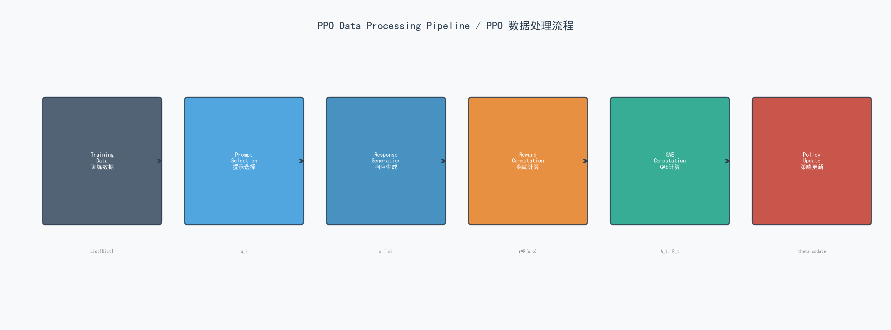
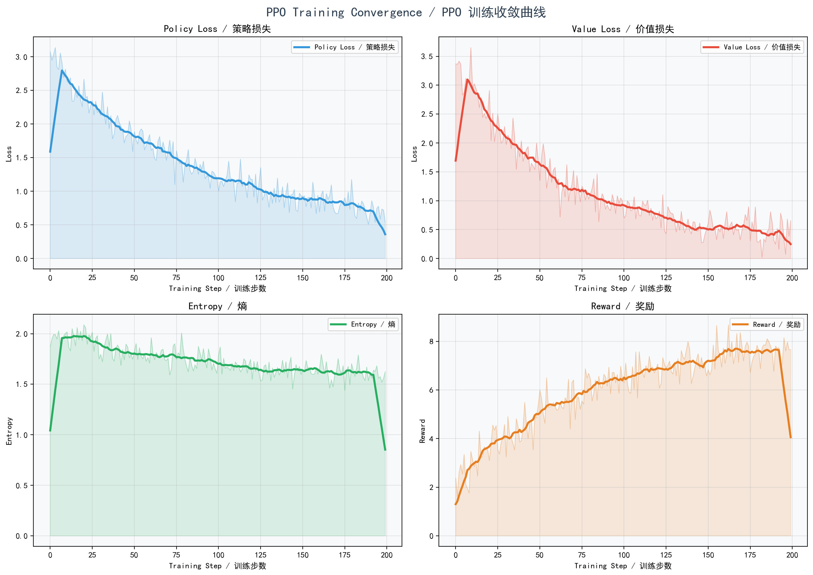

# PPO (Proximal Policy Optimization) 算法详解

> **PPO: 近端策略优化算法** — 最经典的大语言模型强化学习训练算法

---

## 1. 算法概述 / Algorithm Overview

PPO (Proximal Policy Optimization) 由 Schulman 等人于 2017 年提出，是目前工业界应用最广泛的策略梯度算法。在 LLM 训练中，PPO 是 RLHF (Reinforcement Learning from Human Feedback) 的核心组件，被 OpenAI 的 InstructGPT 和 ChatGPT 所采用。

**核心思想**: 通过裁剪概率比 (clipping probability ratio) 来限制每次策略更新的幅度，确保训练稳定性。

**PPO 的三要素**:
1. 裁剪代理目标 (Clipped Surrogate Objective) — 防止过大策略更新
2. 广义优势估计 (GAE) — 准确估计优势函数
3. 价值网络 (Value Network) — 估计状态价值，用于计算优势

---

## 2. 数学公式 / Mathematical Formulation

### 2.1 裁剪代理目标 / Clipped Surrogate Objective

$$L^{CLIP}(\theta) = \mathbb{E}_t\left[\min\left(r_t(\theta)\hat{A}_t,\ \text{clip}(r_t(\theta), 1-\varepsilon, 1+\varepsilon)\hat{A}_t\right)\right]$$

其中概率比 (probability ratio):

$$r_t(\theta) = \frac{\pi_\theta(a_t|s_t)}{\pi_{\theta_{old}}(a_t|s_t)}$$

- $\pi_\theta$: 当前策略
- $\pi_{\theta_{old}}$: 上一轮策略 (固定)
- $\hat{A}_t$: 优势估计值
- $\varepsilon$: 裁剪参数 (通常 0.2)

### 2.2 广义优势估计 / Generalized Advantage Estimation (GAE)

TD 误差 (Temporal Difference error):

$$\delta_t = r_t + \gamma V(s_{t+1}) - V(s_t)$$

GAE 优势:

$$\hat{A}_t^{GAE(\gamma,\lambda)} = \sum_{l=0}^{\infty}(\gamma\lambda)^l \delta_{t+l}$$

- $\gamma \in [0,1]$: 折扣因子 (discount factor)
- $\lambda \in [0,1]$: GAE 参数 (bias-variance tradeoff)
- $V(s_t)$: 状态价值函数

### 2.3 价值函数损失 / Value Function Loss

$$L^{VF}(\theta) = \left(V_\theta(s_t) - V_t^{target}\right)^2$$

其中:

$$V_t^{target} = \hat{A}_t + V(s_t) = \sum_{l=0}^{\infty}\gamma^l r_{t+l}$$

### 2.4 熵正则化 / Entropy Regularization

$$S[\pi_\theta](s_t) = -\sum_a \pi_\theta(a|s_t) \log \pi_\theta(a|s_t)$$

熵正则化鼓励策略保持探索性，防止过早收敛到次优策略。

### 2.5 PPO 总损失 / Total PPO Loss

$$L_{PPO}(\theta) = L^{CLIP}(\theta) - c_1 \cdot L^{VF}(\theta) + c_2 \cdot S[\pi_\theta](s_t)$$

| 系数 | 典型值 | 作用 |
|:---|:---|:---|
| $c_1$ | 0.5 | 价值损失权重 |
| $c_2$ | 0.01 | 熵正则化权重 |
| $\varepsilon$ | 0.2 | 裁剪范围 |
| $\gamma$ | 0.99 | 折扣因子 |
| $\lambda$ | 0.95 | GAE参数 |

---

## 3. 算法流程 / Algorithm Flow


**图注**: PPO 算法完整训练流程图。蓝色节点为策略网络操作，紫色节点为价值网络操作，绿色节点为优势计算，红色节点为损失计算。

### 详细步骤:

1. **输入问题 q**: 从训练集中采样一个问题
2. **策略网络 $\pi_\theta$**: 使用当前策略网络生成响应
3. **生成响应 o**: $o \sim \pi_\theta(\cdot|q)$
4. **计算奖励 r**: 使用奖励函数评估响应质量 $r = R(q, o)$
5. **价值网络 $V_\phi(s)$**: 使用独立的价值网络估计状态价值
6. **GAE 优势估计**: 计算 $\hat{A}_t = \sum_{l}(\gamma\lambda)^l \delta_{t+l}$
7. **裁剪代理损失**: 计算 $L^{CLIP} = \min(r_t \hat{A}_t, \text{clip}(r_t)\hat{A}_t)$
8. **总损失**: $L = L^{CLIP} - c_1 L^{VF} + c_2 S$
9. **更新参数**: 同时更新策略网络 $\theta$ 和价值网络 $\phi$

---

## 4. 数据处理流程 / Data Processing Pipeline



**图注**: PPO 数据处理流水线。数据从训练集出发，经过提示选择、响应生成、奖励计算、GAE计算，最终用于策略更新。

| 阶段 | 输入 | 输出 | 数据形状 |
|:---|:---|:---|:---|
| 提示选择 | 训练集 | 问题 q | str |
| 响应生成 | q | 响应 o, log_prob | (seq_len,) |
| 奖励计算 | (q, o) | 标量奖励 r | float |
| GAE计算 | (r, V(s)) | 优势 A, 回报 R | (T,) |
| 策略更新 | (A, R, log_prob) | 更新后的 θ | - |

---

## 5. 损失函数与收敛分析 / Loss & Convergence



**图注**: PPO 训练过程中的四项关键指标收敛曲线:

| 子图 | 指标 | 初始值 | 收敛值 | 趋势 |
|:---|:---|:---|:---|:---|
| 左上 | Policy Loss | ~2.5 | ~0.5 | 指数下降 |
| 右上 | Value Loss | ~3.0 | ~0.3 | 指数下降 |
| 左下 | Entropy | ~2.0 | ~1.5 | 缓慢下降 |
| 右下 | Reward | ~2.0 | ~8.0 | 指数上升 |

**收敛分析**:
- 策略损失和价值损失在前 80 步内快速收敛，反映了 PPO 裁剪机制的有效性
- 熵从 2.0 缓慢降至 1.5，表明策略逐渐从探索转向利用
- 奖励在训练过程中稳步提升，最终达到约 8.0

---

## 6. 完整实现代码 / Full Implementation

```python
"""
PPO (Proximal Policy Optimization) Training Implementation
PPO (近端策略优化) 训练实现

Mathematical Formulation / 数学公式:
L_PPO(theta) = L_CLIP - c1 * L_VF + c2 * S[pi_theta]
"""

import os
import json
import torch
import torch.nn as nn
import torch.nn.functional as F
from torch.distributions import Categorical
from transformers import AutoModelForCausalLM, AutoTokenizer
from typing import List, Dict, Tuple
import numpy as np
from tqdm import tqdm
import logging
from dataclasses import dataclass

logging.basicConfig(level=logging.INFO)
logger = logging.getLogger(__name__)


@dataclass
class PPOConfig:
    """
    PPO 训练配置 / PPO Training Configuration
    """
    model_name: str = "Qwen/Qwen2.5-0.5B-Instruct"

    # PPO 超参数 / PPO hyperparameters
    clip_epsilon: float = 0.2      # ε - PPO裁剪参数 / clipping parameter
    value_coef: float = 0.5        # c_1 - 价值损失系数 / value loss coefficient
    entropy_coef: float = 0.01     # c_2 - 熵系数 / entropy coefficient
    gamma: float = 0.99            # γ - 折扣因子 / discount factor
    gae_lambda: float = 0.95       # λ - GAE参数 / GAE parameter

    # 训练参数 / Training parameters
    learning_rate_policy: float = 1e-5
    learning_rate_value: float = 3e-5
    max_epochs: int = 3
    ppo_epochs: int = 4            # 每批次PPO更新轮数 / PPO update epochs per batch
    batch_size: int = 4
    max_length: int = 512
    temperature: float = 0.7

    # 奖励参数 / Reward parameters
    accuracy_reward: float = 10.0
    partial_reward: float = 2.0

    device: str = "cuda" if torch.cuda.is_available() else "cpu"
    output_dir: str = "./checkpoints/ppo_model"


class ValueNetwork(nn.Module):
    """
    价值网络 (Critic) / Value Network (Critic)
    估计状态价值 V(s) / Estimates state value V(s)
    """
    def __init__(self, hidden_size: int):
        super().__init__()
        # 三层MLP: hidden -> hidden//2 -> 1
        self.value_head = nn.Sequential(
            nn.Linear(hidden_size, hidden_size),
            nn.Tanh(),
            nn.Linear(hidden_size, hidden_size // 2),
            nn.Tanh(),
            nn.Linear(hidden_size // 2, 1)
        )

    def forward(self, hidden_states: torch.Tensor) -> torch.Tensor:
        """
        前向传播: 计算状态价值 V(s)
        Forward: Compute state value V(s)
        """
        return self.value_head(hidden_states).squeeze(-1)


class PPOTrainer:
    """
    PPO 训练器 / PPO Trainer

    实现 PPO-Clip 变体，包含:
    - 独立的价值网络 (Critic)
    - GAE 优势估计
    - 熵正则化
    """
    def __init__(self, config: PPOConfig):
        self.config = config
        self.device = torch.device(config.device)

        # 加载策略网络 (Actor) / Load policy network (Actor)
        logger.info(f"Loading policy model: {config.model_name}")
        self.policy_model = AutoModelForCausalLM.from_pretrained(
            config.model_name,
            torch_dtype=torch.float16 if "cuda" in config.device else torch.float32,
            device_map="auto"
        )
        self.tokenizer = AutoTokenizer.from_pretrained(config.model_name)
        if self.tokenizer.pad_token is None:
            self.tokenizer.pad_token = self.tokenizer.eos_token

        # 创建价值网络 (Critic) / Create value network (Critic)
        logger.info("Creating value network")
        hidden_size = self.policy_model.config.hidden_size
        self.value_model = ValueNetwork(hidden_size).to(self.device)

        # 优化器: 策略网络和价值网络分别使用不同学习率
        self.policy_optimizer = torch.optim.AdamW(
            self.policy_model.parameters(), lr=config.learning_rate_policy
        )
        self.value_optimizer = torch.optim.AdamW(
            self.value_model.parameters(), lr=config.learning_rate_value
        )

        # 训练统计 / Training statistics
        self.stats = {
            "epoch_policy_losses": [],
            "epoch_value_losses": [],
            "epoch_rewards": [],
            "epoch_entropies": []
        }

    def generate_response(self, prompt: str) -> Tuple[str, torch.Tensor, torch.Tensor]:
        """
        生成响应并返回对数概率和价值估计
        Generate response and return log probability + value estimate

        Returns: (response, log_prob, value_estimate)
        """
        formatted_prompt = f"<|im_start|>user\n{prompt}<|im_end|>\n<|im_start|>assistant\n"
        inputs = self.tokenizer(
            formatted_prompt, return_tensors="pt",
            max_length=self.config.max_length, truncation=True
        ).to(self.device)

        # 生成响应 / Generate response
        with torch.no_grad():
            outputs = self.policy_model.generate(
                **inputs, max_new_tokens=256,
                temperature=self.config.temperature, do_sample=True,
                output_hidden_states=True, return_dict_in_generate=True,
                pad_token_id=self.tokenizer.eos_token_id
            )

        response_ids = outputs.sequences[0]
        response = self.tokenizer.decode(response_ids, skip_special_tokens=False)

        # 提取助手响应部分 / Extract assistant's response
        if "<|im_start|>assistant\n" in response:
            response = response.split("<|im_start|>assistant\n")[-1]
            if "<|im_end|>" in response:
                response = response.split("<|im_end|>")[0]

        # 计算对数概率和价值 / Compute log probability and value
        full_text = formatted_prompt + response.strip()
        full_inputs = self.tokenizer(
            full_text, return_tensors="pt",
            max_length=self.config.max_length, truncation=True
        ).to(self.device)

        with torch.no_grad():
            policy_outputs = self.policy_model(**full_inputs, output_hidden_states=True)
            log_prob = -policy_outputs.loss  # 负损失 = 对数概率
            last_hidden = policy_outputs.hidden_states[-1][:, -1, :]
            value = self.value_model(last_hidden)

        return response.strip(), log_prob, value

    def compute_gae(self, rewards, values, dones):
        """
        计算广义优势估计 (GAE)
        Compute Generalized Advantage Estimation

        delta_t = r_t + gamma * V(s_{t+1}) - V(s_t)
        A_t = delta_t + (gamma*lambda)*delta_{t+1} + ...
        """
        advantages = []
        returns = []
        gae = 0
        next_value = 0

        # 逆序计算GAE / Reverse iteration for GAE
        for t in reversed(range(len(rewards))):
            next_non_terminal = 1.0 - dones[t]
            if t == len(rewards) - 1:
                next_value = 0

            delta = rewards[t] + self.config.gamma * next_value * next_non_terminal - values[t]
            gae = delta + self.config.gamma * self.config.gae_lambda * next_non_terminal * gae

            advantages.insert(0, gae)
            returns.insert(0, gae + values[t])

        advantages = torch.tensor(advantages, device=self.device, dtype=torch.float32)
        returns = torch.tensor(returns, device=self.device, dtype=torch.float32)

        # 归一化优势 / Normalize advantages
        advantages = (advantages - advantages.mean()) / (advantages.std() + 1e-8)
        return advantages, returns

    def ppo_update(self, prompts, responses, old_log_probs, old_values, advantages, returns):
        """
        PPO 多轮更新 / PPO multi-epoch update

        对每批数据执行 ppo_epochs 轮更新
        Perform ppo_epochs rounds of update per batch
        """
        policy_losses = []
        value_losses = []
        entropies = []

        for epoch in range(self.config.ppo_epochs):
            for idx in range(len(prompts)):
                # 准备输入 / Prepare input
                formatted = f"<|im_start|>user\n{prompts[idx]}<|im_end|>\n<|im_start|>assistant\n"
                full_text = formatted + responses[idx]
                inputs = self.tokenizer(
                    full_text, return_tensors="pt",
                    max_length=self.config.max_length, truncation=True
                ).to(self.device)

                # 策略前向传播 / Policy forward pass
                policy_outputs = self.policy_model(**inputs, output_hidden_states=True)
                curr_log_prob = -policy_outputs.loss

                # 计算熵 / Compute entropy
                logits = policy_outputs.logits[:, :-1, :]
                probs = F.softmax(logits, dim=-1)
                log_probs_dist = F.log_softmax(logits, dim=-1)
                entropy = -(probs * log_probs_dist).sum(dim=-1).mean()

                # 计算概率比 / Compute probability ratio
                ratio = torch.exp(curr_log_prob - old_log_probs[idx])

                # PPO裁剪目标 / PPO clipped objective
                advantage = advantages[idx]
                surr1 = ratio * advantage
                surr2 = torch.clamp(
                    ratio, 1.0 - self.config.clip_epsilon,
                    1.0 + self.config.clip_epsilon
                ) * advantage
                policy_loss = -torch.min(surr1, surr2)

                # 价值损失 / Value loss
                last_hidden = policy_outputs.hidden_states[-1][:, -1, :]
                curr_value = self.value_model(last_hidden)
                value_loss = F.mse_loss(curr_value, returns[idx])

                # 总损失 = 策略损失 - c1*价值损失 + c2*熵
                total_loss = (
                    policy_loss
                    + self.config.value_coef * value_loss
                    - self.config.entropy_coef * entropy
                )

                # 反向传播和优化 / Backward and optimize
                self.policy_optimizer.zero_grad()
                self.value_optimizer.zero_grad()
                total_loss.backward()
                self.policy_optimizer.step()
                self.value_optimizer.step()

                policy_losses.append(policy_loss.item())
                value_losses.append(value_loss.item())
                entropies.append(entropy.item())

        return {
            "policy_loss": np.mean(policy_losses),
            "value_loss": np.mean(value_losses),
            "entropy": np.mean(entropies)
        }

    def train(self, dataset: List[Dict]):
        """
        PPO 训练主循环 / PPO training main loop
        """
        logger.info(f"Starting PPO training with {len(dataset)} examples")
        self.policy_model.train()
        self.value_model.train()

        for epoch in range(self.config.max_epochs):
            logger.info(f"Epoch {epoch+1}/{self.config.max_epochs}")
            epoch_rewards = []

            for example in tqdm(dataset, desc=f"Epoch {epoch+1}"):
                # 生成响应 / Generate response
                response, log_prob, value = self.generate_response(example["question"])

                # 计算奖励 / Compute reward
                reward = self._compute_reward(example["question"], response, example["correct_answer"])

                # GAE优势估计 / GAE advantage estimation
                advantage = torch.tensor([reward], device=self.device) - value
                returns = torch.tensor([reward], device=self.device)
                advantage = (advantage - advantage.mean()) / (advantage.std() + 1e-8)

                # PPO更新 / PPO update
                stats = self.ppo_update(
                    [example["question"]], [response],
                    [log_prob], [value], advantage, returns
                )
                epoch_rewards.append(reward)

            self.stats["epoch_rewards"].append(np.mean(epoch_rewards))
            self.save_checkpoint(epoch)

        logger.info("PPO Training completed!")

    def _compute_reward(self, question, response, correct_answer):
        """计算奖励 / Compute reward"""
        reward = 0.0
        predicted = response.split("answer:")[-1].strip() if "answer:" in response.lower() else response.strip()[-20:]
        if predicted.lower().strip() == correct_answer.lower().strip():
            reward += self.config.accuracy_reward
        return reward

    def save_checkpoint(self, epoch):
        """保存检查点 / Save checkpoint"""
        checkpoint_dir = f"{self.config.output_dir}/epoch_{epoch+1}"
        os.makedirs(checkpoint_dir, exist_ok=True)
        self.policy_model.save_pretrained(checkpoint_dir)
        self.tokenizer.save_pretrained(checkpoint_dir)
        logger.info(f"Checkpoint saved to {checkpoint_dir}")


def main():
    """主函数 / Main function"""
    config = PPOConfig()
    with open("data/sample_reasoning_data.json", "r") as f:
        dataset = json.load(f)
    trainer = PPOTrainer(config)
    trainer.train(dataset)


if __name__ == "__main__":
    main()
```

---

## 7. PPO 在 LLM 中的关键设计决策 / Key Design Decisions

| 设计选择 | 原因 |
|:---|:---|
| 独立价值网络 | 准确估计 baseline, 降低策略梯度方差 |
| GAE 优势估计 | 平衡偏差和方差 (lambda 控制权衡) |
| 裁剪概率比 | 防止单步更新过大导致性能崩溃 |
| 熵正则化 | 鼓励探索, 避免过早收敛 |
| 多轮PPO更新 | 提高样本效率 (通常 3-4 轮) |
| KL 散度约束 | (PPO中可选) 限制偏离参考策略 |

---

## 8. PPO 优缺点总结 / Pros and Cons

**优点**:
- 理论基础扎实, 大量实践验证
- 训练稳定性好, 超参数鲁棒
- 适用于通用 RL 场景

**缺点**:
- 需要独立的价值网络, 增加内存和计算开销
- GAE 计算复杂, 需要精心调参
- 样本效率不如 GRPO/DAPO 等新算法

---

*参考论文: Schulman, J. et al. "Proximal Policy Optimization Algorithms." arXiv:1707.06347, 2017.*
